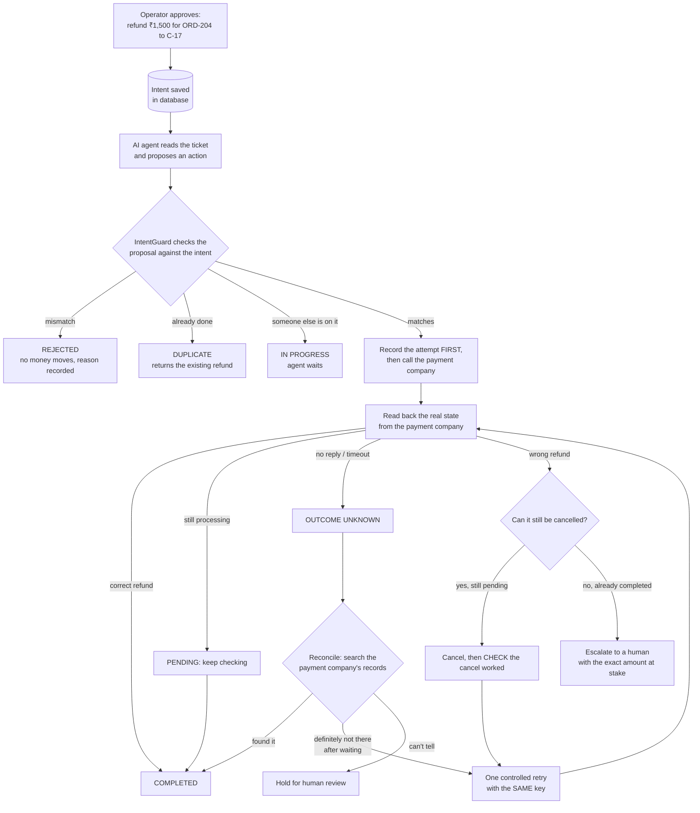
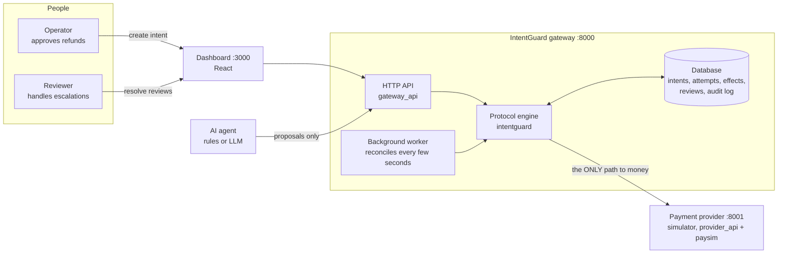
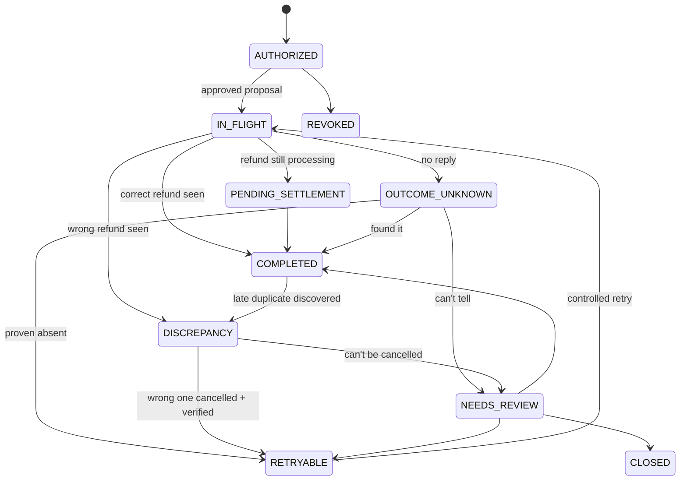

# IntentGuard — The Complete Project Guide

This document explains the whole project in plain words: what problem it solves, what was built,
how the pieces fit together, how to run and use it, what the experiments proved, and what to work
on next. Read it top to bottom once; afterwards, use the table of contents to jump around.

> Everything in this project is a **simulation**. The "payment company" is a program we wrote.
> No real money, bank or payment provider is ever touched.

---

## Table of contents

1. [The project in one minute](#1-the-project-in-one-minute)
2. [The problem we are solving](#2-the-problem-we-are-solving)
3. [The idea behind the solution](#3-the-idea-behind-the-solution)
4. [A refund, step by step](#4-a-refund-step-by-step)
5. [System architecture](#5-system-architecture)
6. [How the safety gateway works inside](#6-how-the-safety-gateway-works-inside)
7. [The payment simulator](#7-the-payment-simulator)
8. [Folder structure](#8-folder-structure)
9. [How to run it](#9-how-to-run-it)
10. [How an end user uses it](#10-how-an-end-user-uses-it)
11. [The API (for developers and agents)](#11-the-api-for-developers-and-agents)
12. [How we proved it works: the experiment](#12-how-we-proved-it-works-the-experiment)
13. [Results: what we solved](#13-results-what-we-solved)
14. [Tests](#14-tests)
15. [Limitations: what is not proven yet](#15-limitations-what-is-not-proven-yet)
16. [What to solve next](#16-what-to-solve-next)
17. [Glossary](#17-glossary)
18. [FAQ](#18-faq)

---

## 1. The project in one minute

Companies want AI agents to handle customer support, including money operations such as refunds.
That is risky: the AI can pick the wrong order, type the wrong amount, or, after a network
glitch, send the same refund twice.

**IntentGuard is a safety layer that sits between the AI agent and the payment company.**

- A human (the *operator*) first approves exactly what should happen: "refund ₹1,500 for order ORD-204 to customer C-17".
- The AI can only *suggest* actions. It can never touch money directly.
- IntentGuard checks every suggestion against the human's approval, sends the payment itself, and then **checks with the payment company what really happened**.
- If something went wrong, it fixes what can be fixed safely and hands everything else to a human, honestly.

We built the full system (safety gateway, payment simulator, dashboard, AI agent connector) and an
experiment with **45,000 simulated situations**. Result: IntentGuard produced **zero duplicate
refunds, zero false reports and zero unnoticed wrong payments**, while the four common
alternatives produced many of each.

---

## 2. The problem we are solving

### 2.1 Why "the API said OK" is not enough

When software sends a refund request to a payment company, four different things can go wrong.
These are the core problems this research is about.

| # | Problem | Real-life example | Why it is dangerous |
|---|---|---|---|
| 1 | **The AI proposes the wrong thing** | Approved ₹1,500, AI sends ₹15,000. Approved ORD-204, AI picks ORD-240 (looks similar). | Money goes to the wrong place or in the wrong amount. |
| 2 | **Uncertain outcome (timeout)** | Request sent, no reply came back. Did the refund happen or not? | Retrying blindly can pay **twice**. Giving up can leave the customer unpaid. |
| 3 | **Changed retry after a crash** | The AI program crashes, restarts and sends the "same" refund with a **new request ID**. | The payment company's duplicate protection only recognises the *same* ID, so it pays again. |
| 4 | **False recovery claims** | The system says "refund reversed" just because it *sent* a cancel request. | The money may still be gone. Reports become lies. |

There are also two "everyday" risks:
- **Two AI agents working on the same ticket at once** (concurrency), and
- **The person who approved the refund loses their permission** before it executes.

### 2.2 The research question

> Can an intent-consistent transaction protocol reduce incorrect and duplicate final financial
> outcomes under timeouts, crashes, changed retries and concurrency, while still completing
> legitimate requests?

In plain words: *Can we make AI-driven refunds safe without stopping the good refunds from happening?*

---

## 3. The idea behind the solution

The core principle is one sentence:

> **Do not trust what the AI says it did, or what the network says happened. Check the real
> state at the payment company.**

To do that, IntentGuard keeps four things separate that most systems mix up:

| Concept | Who creates it | Plain meaning | Example |
|---|---|---|---|
| **Intent** | Human operator | What is *allowed* to happen | "Refund ₹1,500, ORD-204, C-17" |
| **Proposal** | AI agent | What the AI *asks* to do | "Refund ₹15,000, ORD-204, C-17" (wrong!) |
| **Attempt** | IntentGuard | One actual call to the payment company | "Call #1 at 10:02:03, key ig-int_ab12-g0" |
| **Effect** | Payment company | What *really* happened to money | "Refund rf_0001: ₹1,500, COMPLETED" |

Because these are separate:
- a wrong proposal can be rejected *before* any money moves (proposal ≠ intent),
- a timeout is just an attempt with an unknown result, not a failure and not a success,
- a crash-and-retry is a new attempt for the *same* intent, so it can't create a second refund,
- "completed" is only ever declared when an **effect** is seen at the payment company.

---

## 4. A refund, step by step

This is the flow from your diagram, now fully implemented.



### The same story in words

1. **Approval.** Asha (an operator) approves: refund ₹1,500 for ORD-204 to C-17. This becomes an *intent* stored in the database.
2. **The AI proposes.** The AI reads the customer's ticket and proposes a refund.
   - If it says ₹15,000 → **REJECTED** ("amount: authorized 150000, proposed 1500000"). No money moves.
   - If it says ORD-240 → **REJECTED** ("order mismatch").
3. **IntentGuard sends the refund.** It *first* writes "attempt #1 for this intent" to the database (so a crash can't erase the fact it tried), then calls the payment company with a key tied to the intent.
4. **IntentGuard checks the result** by reading the refund back from the payment company.
5. **If the reply was lost**, the refund is marked *unknown*. IntentGuard searches the payment company's records:
   - found → **COMPLETED**, no second refund;
   - not found *after waiting long enough for records to appear* → one careful retry (same key, so the payment company will refuse to pay twice anyway);
   - payment company unreachable → after a while, **held for a human**. It never guesses.
6. **If the AI crashes and restarts** and asks again with a new request ID → **IN PROGRESS** or **DUPLICATE**. The new request is tied to the same intent, so no second refund.
7. **If the payment company paid the wrong amount**:
   - still pending → IntentGuard cancels it, *verifies* the cancellation, then pays the correct amount;
   - already completed (can't be cancelled) → a **review case** for a human with the exact discrepancy. It is never reported as "reversed".
8. **Everything is written to an audit log** that cannot be edited, and any tampering can be detected.

---

## 5. System architecture

### 5.1 The big picture



**Key rule:** the AI agent has no connection to the payment provider. Only the engine does.

### 5.2 The three running services

| Service | Port | What it is | Started by |
|---|---|---|---|
| **Payment provider (simulator)** | 8001 | A fake payment company that behaves like a real one, including failures on demand | `provider_api` |
| **IntentGuard gateway** | 8000 | The safety layer: API + engine + background worker + database | `gateway_api` |
| **Dashboard** | 3000 (or next free port) | Web UI for operators, reviewers and researchers | `frontend` |

### 5.3 The layers inside the code

| Layer | Package | Responsibility |
|---|---|---|
| Domain | `intentguard/domain.py`, `money.py` | The vocabulary: states, decisions, legal state changes, money in paise |
| Rules | `intentguard/checks.py` | Pure functions that decide whether a proposal is acceptable |
| Engine | `intentguard/engine.py` | The protocol: decide → reserve → execute → verify → reconcile → recover |
| Storage | `intentguard/models.py`, `db.py`, `audit.py` | Database tables, database-level safety rules, tamper-evident log |
| Ports/adapters | `intentguard/providers/` | How the engine talks to a payment provider (HTTP or in-process) |
| Agents | `intentguard/agents/` | Turning a ticket's text into a structured proposal (rules or LLM) |
| Delivery | `gateway_api/`, `provider_api/`, `frontend/` | HTTP services and the dashboard |
| Research | `bench/`, `tests_intentguard/` | Experiment runner and automated tests |

The engine never imports the simulator. It only knows the "payment provider" interface
(`intentguard/providers/base.py`). That means the simulator can later be swapped for a real
provider's sandbox **without changing the safety logic**.

---

## 6. How the safety gateway works inside

### 6.1 The checks on every proposal

| Check | Rejects when… | Example caught |
|---|---|---|
| Operator permission | approver is deactivated, lacks the operation, or exceeds their limit | approver's access was revoked |
| Operation | refund vs. authorization differ | AI tries a hold instead of a refund |
| Customer | customer ID differs | C-71 instead of C-17 |
| Order | order ID differs | ORD-240 instead of ORD-204 |
| Currency | currency differs | USD instead of INR |
| Amount | amount differs from the approval | ₹15,000 instead of ₹1,500, or ₹15 (rupees read as paise) |
| Order balance | total refunds on the order would exceed what was paid | second refund that over-refunds an order |
| Already fulfilled | the approved refund already exists | AI asks again after success → DUPLICATE |
| In progress | another attempt is running or being reconciled | concurrent agent → IN PROGRESS |
| Held | a human is reviewing this intent | → HELD |
| Attempt budget | too many attempts already | → HELD for a human |

### 6.2 The states an intent goes through



Every state change is checked against this map (`TRANSITIONS` in `intentguard/domain.py`).
An illegal change is treated as a bug and refused.

### 6.3 The six protective ideas (and why each exists)

| # | Mechanism | Problem it solves | Where |
|---|---|---|---|
| 1 | **Intent binding**: proposals must equal the approval | AI picks wrong order/amount/customer | `checks.py` |
| 2 | **Stable idempotency key per intent** (`ig-<intent>-g<generation>`) | Changed retries and concurrent agents can't pay twice: the payment company sees the same key | `engine._reserve` |
| 3 | **Write the attempt before calling** | A crash mid-call can't hide that money may have moved; on restart it is reconciled | `engine._execute`, `startup_recovery` |
| 4 | **Reconciliation with an absence window** | A timeout is "unknown", not "failed". "Not found" only counts after enough time for records to appear (30 s) | `engine.reconcile` |
| 5 | **State-aware, verified recovery** | Cancel only what can be cancelled, confirm it, escalate the rest; never fake a reversal | `engine.recover` |
| 6 | **Database guarantees + audit chain** | At most one live intended refund per intent (enforced by the database itself); history can't be silently rewritten | `models.py`, `audit.py` |

### 6.4 The background worker

Some things take time: refunds stay *pending* for a while, records take time to appear in search,
the provider might be down. A background worker inside the gateway wakes up every few seconds,
finds intents that need checking (pending, unknown, discrepancy, retryable) and moves them
forward. It checks often at first and then less often (back-off), the way a production system
would.

### 6.5 Recovery rules at a glance

| What went wrong | Status at payment company | IntentGuard does |
|---|---|---|
| Wrong refund | Pending | Cancel → verify cancelled → retry the correct refund |
| Wrong refund | Completed | Cannot be undone → **review case** with amount |
| Wrong authorization hold | Pending or authorized | Void → verify → retry correct hold |
| Cancel refused by provider | Any | **Review case** |
| Result unknown and provider unreachable for 5 min | Unknown | **Review case**, never guess |
| Too many attempts | — | **Review case** |

---

## 7. The payment simulator

`paysim/` is a small program that behaves like a real payment company, so the safety layer can be
tested against realistic behaviour, including failures that are impossible to trigger safely in
a real system.

**Realistic behaviour it models**
- Refunds are created **PENDING** and become **COMPLETED** after a delay.
- A refund can be **cancelled only while pending**. Authorization holds can be **voided** while live.
- **Idempotency keys**: the same key + same details returns the original refund (no new payment); the same key + different details is rejected.
- **Balance and ownership**: you can't refund more than was paid, or refund an order to a different customer.
- **Search is eventually consistent**: a new refund may take time to appear when you search by order (like real providers), while lookup by ID is immediate.
- **State is saved to disk**, so the provider survives restarts.

**Faults you can inject** (to test failure handling):

| Fault | What happens |
|---|---|
| `OUTAGE` | Provider returns 503; nothing executed |
| `TIMEOUT_BEFORE_EXECUTION` | Request times out; nothing executed |
| `LOST_RESPONSE` | Refund **executed**, but the reply is lost |
| `SLOW_SETTLEMENT` | Refund stays pending for a long time |
| `DELAYED_VISIBILITY` | Refund exists but doesn't show up in search for a while |
| `AMOUNT_MISMATCH` | Provider settles a different amount than requested |
| `CANCEL_REJECTED` | Provider refuses to cancel |
| `LOOKUP_OUTAGE` | Provider can't be queried |

There is also `GET /v1/ledger`, the **ground truth**: every transaction that really exists.
The experiment scores everything against this.

---

## 8. Folder structure

```
IntentGuard_Documentation/
│
├── PROJECT_GUIDE.md          ← this document
├── README.md                 ← short technical overview
├── start.bat / stop.bat      ← one-click start; press a key to stop (Windows)
├── Makefile                  ← shortcuts: make test, make benchmark, …
├── requirements.txt          ← Python dependencies
├── docker-compose.yml        ← run everything in Docker with PostgreSQL
├── .env.example              ← all settings, with explanations (copy to .env)
├── pytest.ini                ← test configuration
│
├── intentguard/              ★ THE SAFETY PROTOCOL (the research contribution)
│   ├── domain.py             states, decisions, legal state changes, recovery policy
│   ├── checks.py             the proposal checks (pure functions)
│   ├── engine.py             the protocol engine: decide, execute, verify, reconcile, recover
│   ├── models.py             database tables + database-level safety rules
│   ├── db.py                 database connection, locking
│   ├── audit.py              tamper-evident (hash-chained) audit log
│   ├── config.py             protocol settings; each switch = one ablation
│   ├── money.py              money in paise, formatting (₹1,500.00)
│   ├── clock.py              real clock / simulated clock for experiments
│   ├── providers/            how the engine talks to a payment company
│   │   ├── base.py           the interface (create, get, list, cancel)
│   │   ├── http.py           talks to the provider over HTTP
│   │   └── inprocess.py      talks to the simulator directly (fast, for experiments)
│   └── agents/               turning ticket text into a proposal
│       ├── extraction.py     rule-based extractor (offline, no API key)
│       └── llm.py            LLM extractor (OpenAI / Ollama / Gemini)
│
├── paysim/                   ★ THE PAYMENT COMPANY SIMULATOR
│   └── simulator.py          refunds, holds, idempotency, faults, persistence
│
├── gateway_api/              HTTP service for IntentGuard (port 8000)
│   ├── main.py               endpoints, background worker, demo data, startup recovery
│   ├── schemas.py            request/response formats
│   └── settings.py           reads .env
│
├── provider_api/             HTTP service for the simulator (port 8001)
│   └── main.py               /v1/refunds, /v1/authorizations, /v1/faults, /v1/ledger
│
├── frontend/                 DASHBOARD (React + Vite)
│   ├── src/App.jsx           tabs and layout
│   ├── src/views/            Overview, Intents, IntentDetail, Reviews, Audit, Experiments
│   ├── src/components/       shared UI pieces (badges, toasts, audit badge)
│   ├── src/services/api.js   calls to the gateway API
│   ├── Dockerfile, nginx.conf  production build for Docker
│   └── vite.config.js        dev server, forwards /api to the gateway
│
├── bench/                    ★ THE EXPERIMENT (research evidence)
│   ├── scenarios.py          generates 30 kinds of test situations from a seed
│   ├── agent.py              simulated AI agent with realistic mistakes
│   ├── arms.py               the 5 approaches + ablations being compared
│   ├── runner.py             runs scenarios on a simulated clock (threads, crashes)
│   ├── scoring.py            the judge: scores against the payment company's real records
│   ├── report.py             statistics (confidence intervals) and report tables
│   └── __main__.py           command line: python -m bench run
│
├── experiments/results/
│   ├── latest/               most recent results: summary.md, summary.json, scenarios.csv
│   └── 20261005T141650Z/     the full 10-seed run used in the paper
│
├── tests_intentguard/        AUTOMATED TESTS (42)
│   ├── test_protocol_spec.py       every required behaviour from the project spec
│   ├── test_ablations.py           proof each safety component matters
│   ├── test_concurrency_and_crash.py  2/4/8 agents, crashes, attempt budget
│   ├── test_safety_properties.py   random fault combinations vs. safety rules
│   ├── test_components.py          money, simulator, audit tampering, extraction
│   └── test_http_services.py       full HTTP round trips
│
├── docs/
│   ├── RESEARCH_PAPER_MANUSCRIPT.md   the paper, with the measured results
│   └── …                              earlier planning documents
├── deploy/                   Dockerfiles for gateway and provider
│
└── LEGACY (old prototype — not used, safe to delete)
    src/, backend/, mock-payment-service/, tests/, run_benchmark.py, run_multiple_seeds.py,
    benchmark_results*.json, benchmark_summary.md, failure_analysis.md, pytest_output.txt
```

> **Important about the legacy files:** the old results in `benchmark_summary.md` and the old
> paper tables were **typed into a script, not measured**. Don't cite them. All valid numbers are
> in `experiments/results/`.

---

## 9. How to run it

### 9.1 Requirements
- Windows 10/11 (the `.bat` launcher), Python 3.11+, Node.js 18+.
- macOS/Linux work too: use the manual commands below.

### 9.2 The easy way (Windows)

Double-click **`start.bat`**. It will:
1. create `.env` if missing, and fix an old database setting if needed;
2. install Python and dashboard dependencies if they are missing;
3. stop any IntentGuard copy that is still running (it never touches your other apps);
4. start the provider (8001), the gateway (8000) and the dashboard (3000, or the next free port),
   waiting until each one responds;
5. open the dashboard in your browser.

**To stop:** press any key in the launcher window. Everything IntentGuard closes.
(`stop.bat` does the same if you closed the launcher.)

### 9.3 The manual way (any OS)

```bash
pip install -r requirements.txt
cd frontend && npm install && cd ..

# terminal 1 — payment provider simulator
python -m uvicorn provider_api.main:app --port 8001
# terminal 2 — IntentGuard gateway
python -m uvicorn gateway_api.main:app --port 8000
# terminal 3 — dashboard
cd frontend && npm run dev
```

### 9.4 Useful addresses

| What | Address |
|---|---|
| Dashboard | http://localhost:3000 (or the port `start.bat` prints) |
| Gateway API (interactive docs) | http://127.0.0.1:8000/docs |
| Payment simulator (interactive docs, fault injection) | http://127.0.0.1:8001/docs |

### 9.5 Settings you might change (`.env`)

| Setting | Default | Meaning |
|---|---|---|
| `DATABASE_URL` | `sqlite:///./intentguard_gateway.db` | Where the gateway stores data (PostgreSQL also supported) |
| `PAYMENT_PROVIDER` | `http` | `inprocess` runs the simulator inside the gateway (no port 8001 needed) |
| `ABSENCE_WINDOW_S` | `30` | How long to wait before "not found" counts as "didn't happen" |
| `MAX_ATTEMPTS` | `3` | Attempts per intent before a human must look |
| `UNKNOWN_REVIEW_AFTER_S` | `300` | How long an unknown outcome may last before escalation |
| `LLM_PROVIDER` | `offline` | `openai`, `ollama` or `gemini` to use a real LLM agent (plus its key) |
| `DEMO_SEED` | `true` | Create demo operators and orders on first start |

### 9.6 Demo data created on first start

| Operators | Permissions |
|---|---|
| `op-asha` | refunds and authorization holds, up to ₹50,000 |
| `op-ravi` | refunds only, up to ₹5,000 |

| Order | Customer | Paid |
|---|---|---|
| `ORD-204` | C-17 | ₹5,000 |
| `ORD-240` | C-17 | ₹12,000 (look-alike of ORD-204, same customer!) |
| `ORD-2041` | C-71 | ₹20,000 (look-alike, different customer) |
| `ORD-311` | C-17 | ₹8,000 |

---

## 10. How an end user uses it

There are three kinds of users. In a real company they would be different people; in the demo
you play all three.

### 10.1 The Operator (approves refunds)

*Who:* a support lead or finance person.
*Goal:* decide what refund is allowed.

1. Open the dashboard → **Intents** → **New intent**.
2. Choose the operator (`op-asha`), the order (`ORD-204`; the customer fills in automatically), the operation (Refund) and the amount (`1500`).
3. Paste the customer's ticket text, e.g. *"Customer C-17: refund ₹1,500 for order ORD-204, item arrived damaged."*
4. Save. The intent appears with state **AUTHORIZED**.

The system refuses approvals that break the rules: an amount above the operator's limit, an order
that belongs to another customer, or more than the order is worth.

### 10.2 The AI agent (proposes actions)

*Who:* an automated AI assistant (in the demo, you click a button).
*Goal:* carry out the approved refund.

- **From the dashboard:** open the intent → **Run agent**. The agent reads the ticket, extracts customer / order / amount / currency, and submits a proposal. You see what it extracted and the gateway's decision.
- **Manually:** **Submit proposal** shows a form pre-filled from the intent. Change the amount to `15000` or the order to `ORD-240` to watch the gateway **reject** it, with the reason.
- **From another program:** call the API (section 11). This is how a real AI agent connects.

What the agent gets back:

| Answer | Meaning | What the agent should do |
|---|---|---|
| `APPROVED` + `COMPLETED` | Done, verified at the payment company | Tell the customer it's done |
| `APPROVED` + `PENDING_SETTLEMENT` / `OUTCOME_UNKNOWN` | Gateway owns it now | Stop; don't retry; the gateway finishes it |
| `REJECTED` | Proposal doesn't match the approval | Re-read the ticket and fix the proposal |
| `DUPLICATE` | Already done | Don't do anything again |
| `IN_PROGRESS` | Someone else is handling it | Wait |
| `HELD` | A human is reviewing | Wait for the human |

### 10.3 The Reviewer (handles what the machine can't)

*Who:* a senior finance or support person.
*Goal:* deal with cases that can't be fixed automatically.

1. Dashboard → **Reviews** shows open cases with the reason and the amount at stake, e.g. *"IRREVERSIBLE_DISCREPANCY: ₹13,500"* (the provider paid ₹15,000 instead of ₹1,500 and the refund is already completed).
2. After checking the outside world, the reviewer picks one resolution:

| Resolution | When to use | What happens next |
|---|---|---|
| `CONFIRMED_COMPLETED` | The correct refund really exists | Intent → COMPLETED |
| `CONFIRMED_NO_EFFECT` | Verified nothing happened | Intent may be retried |
| `MANUALLY_REMEDIATED` | The wrong payment was fixed outside the system (e.g. recovered from the customer) | Intent is retried with a fresh key |
| `CLOSED_UNFULFILLED` | Give up on this refund | Intent → CLOSED |

### 10.4 The researcher / auditor

- **Overview** tab: live counts (intents by state, decisions, wrong money currently flagged, open reviews).
- **Intent detail**: a timeline of everything that happened to one refund (proposals, attempts, effects, reviews, audit events) in time order.
- **Audit** tab: every event; **Verify** recomputes the hash chain and reports if anything was altered.
- **Experiments** tab: the latest benchmark results, as tables and charts.

### 10.5 Try the failure scenarios yourself

Open http://127.0.0.1:8001/docs → `POST /v1/faults`, inject a fault, then **Run agent** on a fresh intent:

| Inject | What you'll see in IntentGuard |
|---|---|
| `{"kind": "LOST_RESPONSE", "order_id": "ORD-204"}` | Reply lost → reconciliation finds the refund → COMPLETED, only **one** refund in `/v1/ledger` |
| `{"kind": "TIMEOUT_BEFORE_EXECUTION", "order_id": "ORD-204"}` | OUTCOME_UNKNOWN → after ~30 s the worker proves nothing happened → retries → COMPLETED |
| `{"kind": "AMOUNT_MISMATCH", "order_id": "ORD-204", "params": {"factor": 10}}` | Wrong amount completed → NEEDS_REVIEW with the discrepancy |
| Add `{"kind": "SLOW_SETTLEMENT", "order_id": "ORD-204", "params": {"settle_delay_s": 120}}` first, then AMOUNT_MISMATCH | Wrong refund still pending → cancelled and verified → correct refund paid |
| `{"kind": "LOOKUP_OUTAGE", "order_id": "ORD-204", "times": -1}` + LOST_RESPONSE | Can't confirm anything → held for review after 5 min, never guessed |

---

## 11. The API (for developers and agents)

Full interactive documentation: http://127.0.0.1:8000/docs. Amounts are sent as decimal strings
in rupees (`"1500.00"`) and stored as paise.

| Method | Path | Who uses it | Purpose |
|---|---|---|---|
| POST | `/api/intents` | Operator | Approve a refund/hold |
| GET | `/api/intents` | Anyone | List intents (filter by `state`) |
| GET | `/api/intents/{id}` | Anyone | Full timeline of one intent |
| POST | `/api/intents/{id}/proposals` | AI agent | Submit a structured proposal |
| POST | `/api/intents/{id}/agent` | Demo | Let the built-in agent read the ticket and propose |
| POST | `/api/intents/{id}/reconcile` | Operator | Force a check now |
| POST | `/api/intents/{id}/revoke` | Operator | Withdraw an approval (only before money moved) |
| GET | `/api/reviews` | Reviewer | Open (or resolved) review cases |
| POST | `/api/reviews/{id}/resolve` | Reviewer | Resolve a case |
| GET | `/api/audit`, `/api/audit/verify` | Auditor | Read / verify the audit log |
| GET | `/api/metrics` | Dashboard | Live counts |
| GET | `/api/experiments/latest` | Dashboard | Latest benchmark results |
| GET/POST/PATCH | `/api/operators`, `/api/orders` | Admin | Manage operators and orders |

Example: an agent submitting a proposal

```bash
curl -X POST http://127.0.0.1:8000/api/intents/<intent_id>/proposals \
  -H "Content-Type: application/json" \
  -d '{"agent_id":"my-agent","operation":"REFUND","customer_id":"C-17",
       "order_id":"ORD-204","amount":"1500.00","currency":"INR"}'
```

---

## 12. How we proved it works: the experiment

Building a safety system is not enough for research; we must **measure** it against alternatives.

### 12.1 What we compared

| Approach | Description |
|---|---|
| **A: Direct access** | The AI calls the payment company directly (what many demos do) |
| **B: Fixed rules** | Simple rules: order belongs to the customer, currency matches, amount ≤ ₹50,000, don't exceed what was paid |
| **C: Idempotency keys only** | The AI's request ID is used as the payment company's duplicate-protection key |
| **D: Reviewer** | A second checker re-reads the ticket and must agree with the proposal before sending |
| **E: IntentGuard** | The full protocol |
| **Ablations** | IntentGuard with one or two protections switched off, to see what each contributes |

### 12.2 The test situations

- **30 kinds of situations** in 6 families: normal refunds, AI mistakes (×10 amount, rupee/paise confusion, look-alike order IDs, wrong customer, wrong currency), payment-company faults (all 8 kinds), runtime events (crashes, restarts with changed requests, 2–4 agents at once), payment authorization holds, and revoked approvers.
- **300 situations per run × 10 runs** with different random seeds. The seed changes *which* situations appear, not just the IDs.
- 40% of AI mistakes are **stubborn** (repeated on retry). There, the correct outcome is that *nothing* is paid.

### 12.3 How it is judged fairly

- Every approach gets **exactly the same** AI behaviour, faults and situations.
- The judge (`bench/scoring.py`) only looks at the **payment company's real records** after 15 simulated minutes, and uses the same rules for all approaches.
- A system's own claims are only used to catch **false reports** (saying "done" when it isn't, or "failed" when money moved).
- Results are averaged over 10 seeds with 95% confidence intervals.

Run it yourself: `python -m bench run` (about 13 minutes) or `python -m bench run --seeds 2 --scenarios 60` (about 1 minute).

---

## 13. Results: what we solved

### 13.1 Main results (per 300 situations, averaged over 10 seeds)

| Approach | Fully correct | Duplicate refunds | Wrong money moved | **Wrong money nobody noticed** | **False reports** |
|---|---|---|---|---|---|
| A: Direct access | 74.5% | 14.4 | ₹15.2 lakh | ₹15.2 lakh | 138.5 |
| B: Fixed rules | 70.5% | 14.4 | ₹12.1 lakh | ₹12.1 lakh | 132.4 |
| C: Idempotency only | 76.6% | 8.1 | ₹14.9 lakh | ₹14.9 lakh | 99.3 |
| D: Reviewer | 84.0% | 15.4 | ₹14.0 lakh | ₹14.0 lakh | 112.9 |
| **E: IntentGuard** | **95.6%** | **0** | ₹5.5 lakh | **₹0** | **0** |

### 13.2 What this means, problem by problem

| Problem from section 2 | Solved? | Evidence |
|---|---|---|
| 1. AI proposes the wrong thing | ✅ Yes | 100% of AI-mistake situations handled correctly; look-alike orders: A/C 38% vs. IntentGuard 100% |
| 2. Timeouts / uncertain outcomes | ✅ Yes | Lost replies: 0 duplicates; unknown outcomes are reconciled, never guessed |
| 3. Changed retries after crashes | ✅ Yes | Restart with a new request: A/C 81% vs. IntentGuard 100%. Even with a *changed* proposal: 55% vs. 100% |
| 4. False recovery claims | ✅ Yes | 0 false reports; every reversal is confirmed by the provider |
| Concurrent agents | ✅ Yes | 79% vs. 100%; tests with 2/4/8 simultaneous agents give exactly one refund |
| Revoked approver | ✅ Yes | 0% vs. 100% |
| Payment company itself pays a wrong amount that can't be undone | ⚠️ Detected, not fixable | All 133 such cases (pooled across seeds) escalated to a human with the exact amount. This money cannot be recovered by any software |

**Why IntentGuard is "only" 95.6% correct:** the remaining 4.4% are situations where the payment
company itself paid the wrong amount and no longer allows a reversal. No software can undo that;
IntentGuard's job is to catch it and report it honestly, and it did so in **100%** of these cases.

### 13.3 What the ablations taught us

- **Some protections back each other up.** Turning off any *one* of {duplicate gate, reconciliation, waiting window, locking} changes almost nothing, because the stable payment key also catches the duplicate. Turning off the key **together with** one of them brings duplicates back (up to 9.8 per 300) and false reports (up to 43.6). This is *defence in depth*, and it's a real research finding.
- **Two protections have no backup.**
  - Without *intent binding*, unsafe outcomes almost triple (13.3 → 36.8).
  - Without *verified recovery*, the system reports "all fine" while ₹5.5 lakh of wrong payments go **unnoticed**.

### 13.4 The costs of safety
- About **38 ms** extra per request (in this local setup).
- About **13 human reviews per 300 situations**, exactly the cases a human must look at.

---

## 14. Tests

Run: `python -m pytest` (42 tests, about 1 minute).

| Test file | What it proves |
|---|---|
| `test_protocol_spec.py` | Every required behaviour from the project specification, one test each |
| `test_ablations.py` | Each protection really changes behaviour in the situation it exists for, including a forced two-agent race |
| `test_concurrency_and_crash.py` | 2, 4 and 8 agents at once → exactly one refund; crash at either point → recovered with one refund; attempt limit → human review |
| `test_safety_properties.py` | 150 random combinations of faults, wrong proposals, crashes and restarts; safety rules hold in all |
| `test_components.py` | Money handling, simulator behaviour, audit tampering detection, ticket extraction, state machine |
| `test_http_services.py` | Full HTTP round trips through both real services |

---

## 15. Limitations: what is not proven yet

Being honest about these makes the research stronger.

1. **Simulated payment company.** It copies documented behaviour of real providers, but has not been checked against a real provider's sandbox.
2. **Scripted AI mistakes.** The AI's errors come from a written error model, not from a real LLM's behaviour.
3. **Baseline D is optimistic.** Offline, the reviewer uses the same extractor that defines the right answer, so it catches every AI mistake, more than a real LLM reviewer would.
4. **The 30-second waiting window is an assumption.** If a provider takes longer *and* the payment key is unavailable, duplicates are possible (measured in the ablations).
5. **Database.** Experiments used SQLite. PostgreSQL is supported but was not tested automatically.
6. **Speed numbers** are from a single laptop and don't predict production performance.
7. **Synthetic data only.** Real tickets and real order histories may contain situations the generator doesn't.

---

## 16. What to solve next

These are ordered from "most important for the research" to "nice to have".

### 16.1 Next research problems

| # | Problem | Why it matters | How to start |
|---|---|---|---|
| 1 | **Real LLM agents instead of scripted mistakes** | Today's AI errors are modelled; reviewers will ask "do real LLMs actually make these?" | Run `--llm-reviewer` and the agent endpoint with 2–3 real models on generated tickets; measure each model's error rate and whether IntentGuard still holds |
| 2 | **Real data from your other project** | Real ticket wording, order histories and error rates make the results credible | Add a `ReplayScenarioSource` that reads anonymised real tickets/orders (keep the data out of this repo) |
| 3 | **A real provider sandbox** | Prove the simulator matches reality | Add a provider adapter for Stripe test mode or Razorpay test mode (`intentguard/providers/`), and run the same scenarios |
| 4 | **Ambiguous approvals** | Today an approval is exact ("₹1,500"). Real approvals can be ranges ("up to ₹2,000") or several items | Extend the intent with amount policies and multi-line refunds; add matching rules and scenarios |
| 5 | **Learning the waiting window** | 30 s is a fixed guess; providers differ | Measure provider visibility delays and set the window per provider automatically; study the safety/speed trade-off |
| 6 | **Multi-step operations** | E.g. "cancel order, then refund, then send a voucher": partial failures across steps | Model a sequence of intents with dependencies and compensations (a saga), and test crash points between steps |
| 7 | **Reducing human reviews** | 13 per 300 situations is a cost | Classify review cases, auto-resolve the safe ones with stronger evidence, measure accuracy |

### 16.2 Engineering work to make it production-ready

| Item | Status | Next step |
|---|---|---|
| PostgreSQL | Code ready, untested | Add a test run against PostgreSQL in Docker (row locks, triggers) |
| Several gateway copies at once | Designed for it (leases, locks), untested | Run 2 gateways against one database in the concurrency tests |
| Authentication | None (demo only) | Logins and roles: operators approve, reviewers resolve, agents only propose |
| Idempotency key expiry | Simulated (24 h), not tested | Add scenarios where a retry happens after the provider forgets the key |
| Monitoring | Logs only | Metrics/alerts for unknown outcomes, review backlog, discrepancy amounts |
| Clean-up | Old code still present | Delete the legacy folders (section 8) |
| Clean provenance | Results came from uncommitted code | Commit, then rerun `python -m bench run` so results record the exact version |

### 16.3 For the paper

1. Commit the code and rerun the benchmark for a clean version stamp.
2. Add the real-LLM experiment (16.1 #1). It is the most likely reviewer question.
3. Position the work clearly: idempotency keys, sagas and LLM reviewers are **not** new. The contribution is the **combination for unreliable AI callers**, shown by the ablations: tying the key to the approval, waiting before trusting "not found", and only reporting reversals the provider confirms.

---

## 17. Glossary

| Term | Meaning |
|---|---|
| **Intent** | A human-approved operation: who, which order, what operation, how much |
| **Proposal** | What the AI agent asks to do; checked against the intent |
| **Attempt** | One real call to the payment company, recorded before it happens |
| **Effect** | A transaction that really exists at the payment company |
| **Idempotency key** | A label sent with a payment request; the payment company refuses to execute the same label twice |
| **Reconciliation** | Asking the payment company what really happened after an unclear result |
| **Absence window** | How long to wait before "not found" is trusted as "didn't happen" |
| **Discrepancy** | A live payment that doesn't match the approval (wrong amount/order/customer, or a duplicate) |
| **Review case** | A problem handed to a human, with the amount at stake |
| **Audit chain** | A log where each entry contains a fingerprint of the previous one, so edits are detectable |
| **Ablation** | Switching off one part of the system to measure what it contributes |
| **Seed** | A number that makes a random experiment repeatable |
| **Paise** | 1/100 of a rupee. Money is stored in paise to avoid rounding errors |
| **Arm** | One of the approaches compared in the experiment |

---

## 18. FAQ

**Does this move real money?**
No. The payment company is a simulator. Never put real payment credentials into `.env`.

**Do I need an OpenAI/Gemini key?**
No. The built-in agent works offline with rules. A key only enables the optional LLM agent.

**Why did the old paper say 98.4% and now it says 95.6%?**
The old numbers were typed into a script, not measured. 95.6% is measured, and the missing 4.4% are
cases no software can fix (the payment company paid wrongly and won't reverse). IntentGuard catches all of them.

**Why does the dashboard open on port 3002 instead of 3000?**
Another app on your computer already uses 3000 (and 3001). The launcher picks the next free port
and never closes your other apps.

**Where are the results the paper uses?**
`experiments/results/20261005T141650Z/summary.md` (same as `experiments/results/latest/` until you run again).

**How do I connect my own AI agent?**
Have it call `POST /api/intents/{id}/proposals` with the structured fields (section 11) and follow
the "What the agent gets back" table in section 10.2. It must never call the payment company directly.

**Can I use it with my other project's real data later?**
Yes. That's what the provider interface (`intentguard/providers/`) and a future scenario-replay
source are for (section 16.1, items 2–3). The safety logic doesn't change.
