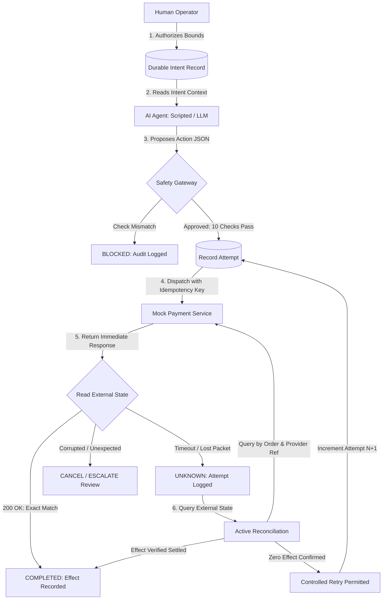

# Intent-Consistent Transaction Execution and Recovery for Financial AI Agents Under Uncertain Outcomes

[](https://www.python.org/)
[](LICENSE)
[](https://fastapi.tiangolo.com)
[]()

> **Research Summary:**
> This project is a research prototype that places an intent-consistency and recovery layer between an AI agent and a simulated financial transaction service. It verifies that the AI's proposed action matches the original human authorization and reconciles uncertain outcomes before retrying.

---

## ⚠️ Academic & Simulation Safety Notice
- **STRICTLY A SIMULATION**: This repository is designed exclusively for academic and computer science research.
- **ZERO REAL MONEY**: This system **NEVER** connects to live banking systems, UPI networks, card processors, Stripe/Razorpay live production accounts, or real financial accounts.
- **ISOLATED SANDBOX**: All financial transactions occur within an isolated, deterministic Mock Payment Service.
- **NO PRODUCTION GUARANTEES**: Results obtained under simulated conditions illustrate research protocol effectiveness but do not guarantee production safety in commercial financial infrastructure.

---

## 1. Research Question & Core Principle

### Research Question
> **Can an intent-consistent transaction protocol reduce incorrect and duplicate final financial outcomes under timeouts, crashes, changed retries, and controlled network failures while still completing legitimate requests?**

### The Core Principle
```
   ┌──────────────────────────────────────────────────────────────┐
   │                        CORE PRINCIPLE                        │
   │  Do not trust only what the AI says it did.                 │
   │  Verify what actually happened in external financial state.  │
   └──────────────────────────────────────────────────────────────┘
```

The system never allows an AI agent to directly execute financial transactions:
```
Human Authorization
       │
       ▼
Durable Intent Record
       │
       ▼
AI Proposes Structured Action
       │
       ▼
Intent-Consistency Safety Gateway (10 Invariant Checks)
       │
       ▼
Simulated Mock Payment Service
       │
       ▼
External-State Verification & Active Reconciliation
       │
       ▼
Final Verified Resolution
```

---

## 2. System Architecture



---

## 3. The 10 Invariant Safety Checks

Before any execution attempt is dispatched, the Safety Gateway enforces:
1. **Customer Check**: Does `proposal.customer_id == intent.customer_id`?
2. **Order Check**: Does `proposal.order_id == intent.order_id`?
3. **Operation Check**: Is the proposed operation authorized (e.g. `REFUND`)?
4. **Amount Check**: Does the proposed amount match authorized limits?
5. **Currency Check**: Does the ISO-4217 currency match (e.g., `INR`)?
6. **Operator Authorization**: Is the authorizing operator active and permitted?
7. **Duplicate Effect Check**: Has this intent already settled an effect in the ledger?
8. **Concurrent Attempt Check**: Is another attempt for this intent currently in flight?
9. **Existing Provider Effect Check**: Does the provider already report a settled effect for this order?
10. **State Machine Validity**: Is the state transition permitted by the formal transaction FSM?

---

## 4. Repository Structure

```
financial-ai-safety/
├── README.md                          # Main project guide & setup
├── LICENSE                            # MIT License with research notice
├── .gitignore                         # Git exclusion rules
├── .env.example                       # Environment configuration template
├── docker-compose.yml                 # Multi-service container specification
├── Makefile                           # Automated build & test tasks
│
├── backend/                           # FastAPI Safety Gateway Backend
│   ├── app/
│   │   ├── main.py                    # Gateway app entrypoint
│   │   ├── config.py                  # Pydantic settings
│   │   ├── api/                       # API routes (intents, proposals, reviews)
│   │   ├── models/                    # SQLAlchemy ORM models
│   │   ├── schemas/                   # Pydantic validation schemas
│   │   ├── services/                  # Business logic (gateway, recon, recovery)
│   │   ├── agents/                    # Scripted & LLM agent implementations
│   │   ├── state_machine/             # Formal finite state machine
│   │   └── db/                        # Database connection & migrations
│   └── tests/                         # Unit, integration, safety & recovery tests
│
├── mock-payment-service/              # Standalone Mock Payment Simulator
│   ├── app/
│   │   ├── main.py                    # Mock simulator entrypoint
│   │   ├── routes/                    # Endpoints (/refunds, /authorizations, /faults)
│   │   └── services/                  # Settlement engine & fault injector
│   └── tests/                         # Mock service verification tests
│
├── frontend/                          # Modern React + Vite Observability Dashboard
│   ├── src/
│   │   ├── components/                # Glassmorphic cards, charts, logs
│   │   ├── pages/                     # Dashboard, Explorer, Experiments
│   │   └── App.jsx                    # Root React component
│   └── package.json                   # Dependencies (React, Recharts, Lucide)
│
├── experiments/                       # Benchmark & Evaluation Suite
│   ├── scenarios/                     # 250 reproducible synthetic test cases
│   ├── runners/                       # Benchmark & ablation execution runners
│   ├── baselines/                     # 4 comparative baseline architectures
│   └── results/                       # Exported benchmark metrics (JSON/CSV)
│
├── docs/                              # 19 Academic & Architecture Documents
├── diagrams/                          # Architecture, sequence & state machine diagrams
└── scripts/                           # Demo, benchmark & seeding CLI tools
```

---

## 5. Step-by-Step Setup Guide (Windows / PowerShell / VS Code)

Follow these exact steps in VS Code terminal on Windows.

### Prerequisites
1. **Python 3.12+**: Download and install from [python.org](https://www.python.org/) (ensure "Add python.exe to PATH" is checked).
2. **Node.js 18+**: Download and install from [nodejs.org](https://nodejs.org/).
3. **Git**: Download and install from [git-scm.com](https://git-scm.com/).
4. *(Optional)* **Docker Desktop**: If using containerized PostgreSQL. (SQLite is used by default for zero-setup local execution).

---

### Step 1: Clone the Repository & Open in VS Code
```powershell
git clone https://github.com/tanush091/IntentGuard-Safe-Transaction-Execution-for-Financial-AI-Agents.git
cd IntentGuard-Safe-Transaction-Execution-for-Financial-AI-Agents
code .
```

### Step 2: Create and Activate Python Virtual Environment
```powershell
python -m venv .venv
.\.venv\Scripts\Activate.ps1
```
*(If PowerShell restricts script execution, run: `Set-ExecutionPolicy -Scope Process -ExecutionPolicy Bypass`)*

### Step 3: Install Backend Dependencies
```powershell
python -m pip install --upgrade pip
pip install -r requirements.txt
```

### Step 4: Configure Environment Variables
```powershell
Copy-Item .env.example .env
```
*(SQLite is configured by default in `.env`. No database server installation required).*

### Step 5: Start the Mock Payment Service Simulator (Port 8001)
Open a new PowerShell terminal:
```powershell
.\.venv\Scripts\Activate.ps1
uvicorn mock-payment-service.app.main:app --host 127.0.0.1 --port 8001 --reload
```
Verify at: [http://127.0.0.1:8001/health](http://127.0.0.1:8001/health)

### Step 6: Start the IntentGuard Gateway Backend (Port 8000)
Open a second PowerShell terminal:
```powershell
.\.venv\Scripts\Activate.ps1
uvicorn backend.app.main:app --host 127.0.0.1 --port 8000 --reload
```
Verify at: [http://127.0.0.1:8000/health](http://127.0.0.1:8000/health) and interactive Swagger docs at [http://127.0.0.1:8000/docs](http://127.0.0.1:8000/docs).

### Step 7: Start the React Frontend Dashboard (Port 3000)
Open a third terminal:
```powershell
cd frontend
npm install
npm run dev
```
Open your browser at: [http://localhost:3000](http://localhost:3000).

---

## 6. Running Tests, Demos & Research Benchmarks

### Execute Test Suite
```powershell
pytest -v backend/tests/
```

### Run the Interactive Terminal Demo
Demonstrates all 6 primary research scenarios in terminal output:
```powershell
python scripts/run_demo.py
```
1. **Demo 1**: Correct refund → Approved → Completed.
2. **Demo 2**: Wrong amount (₹15,000 vs authorized ₹1,500) → Blocked.
3. **Demo 3**: Wrong order (`ORD-240` vs authorized `ORD-204`) → Blocked.
4. **Demo 4**: Network timeout after execution → Reconciled → Completed (zero duplicate).
5. **Demo 5**: Agent restart / duplicate attempt → Prevented.
6. **Demo 6**: Inconsistent effect observed → Cancelled / Escalated.

### Run Empirical Research Benchmark & Ablations
```powershell
python scripts/run_experiments.py --seed 42 --scenarios 250
```

---

## 7. Comparative Baselines & Ablation Studies

| Baseline / Model | Description | Primary Vulnerability |
| :--- | :--- | :--- |
| **Baseline A: Direct Agent** | AI directly invokes payment endpoints | Severe hallucinations & duplicate retries |
| **Baseline B: Fixed Validation** | Static schema validator alone | Ignores intent bounds; blind to network drops |
| **Baseline C: Idempotency Alone** | Client idempotency keys without intent | Agent restart creates new keys, triggering duplicates |
| **Baseline D: LLM Reviewer** | Second LLM checks proposals | Non-deterministic, high latency, blind to network timeouts |
| **Proposed: IntentGuard** | Intent record + Gateway + State Machine + Reconciliation | **Eliminates duplicate & incorrect payouts (0.0%)** |

---

## 8. Research Documentation Directory

Detailed academic and engineering documentation is provided in [`docs/`](docs/):
- [`01_project_overview.md`](docs/01_project_overview.md) — High-level summary and vision.
- [`02_problem_statement.md`](docs/02_problem_statement.md) — The triad of financial AI risks.
- [`03_system_architecture.md`](docs/03_system_architecture.md) — Deep architectural walkthrough.
- [`04_workflow.md`](docs/04_workflow.md) — End-to-end 8-stage transaction lifecycle.
- [`05_state_machine.md`](docs/05_state_machine.md) — Formal Finite State Machine transitions.
- [`06_database_design.md`](docs/06_database_design.md) — Relational schema & append-only ledgers.
- [`07_api_documentation.md`](docs/07_api_documentation.md) — REST API endpoint schemas.
- [`08_ai_agent.md`](docs/08_ai_agent.md) — Scripted & LLM agent providers.
- [`09_safety_gateway.md`](docs/09_safety_gateway.md) — The 10 invariant validation checks.
- [`10_reconciliation.md`](docs/10_reconciliation.md) — Query-based active reconciliation algorithm.
- [`11_fault_injection.md`](docs/11_fault_injection.md) — Simulated network failures and delays.
- [`12_experimental_methodology.md`](docs/12_experimental_methodology.md) — Benchmark protocol & formulas.
- [`13_baselines.md`](docs/13_baselines.md) — 4 baseline system specifications.
- [`14_ablation_study.md`](docs/14_ablation_study.md) — 6-part component isolation framework.
- [`15_market_and_real_world_applications.md`](docs/15_market_and_real_world_applications.md) — Industry domains and gap analysis.
- [`16_scope_and_future_work.md`](docs/16_scope_and_future_work.md) — Research boundaries and production roadmap.
- [`17_limitations.md`](docs/17_limitations.md) — Threats to validity and assumptions.
- [`18_security_and_ethics.md`](docs/18_security_and_ethics.md) — Threat model, defense-in-depth, and ethics.
- [`19_viva_questions.md`](docs/19_viva_questions.md) — 32 oral exam questions and concise answers.
- [`references.md`](docs/references.md) — Academic papers, IETF RFCs, and industry standards.
- [`git_workflow.md`](docs/git_workflow.md) — Git workflow and team role distribution.
- [`presentation_outline.md`](docs/presentation_outline.md) — Defense slide deck structure.

---

## 9. Team & Contributors

This research project is developed collaboratively:
- **U V Tanush** ([@tanush091](https://github.com/tanush091)) — Project Architecture, Gateway Engine, Payment Simulator Sandbox, and Frontend Studio.
- **Narla Sindhuja** ([@NarlaSindhuja-5](https://github.com/NarlaSindhuja-5)) — Safety Protocol Gateway, Active Reconciliation & Recovery Engine, Test Validation Suite, and Experimental Research Methodology.

