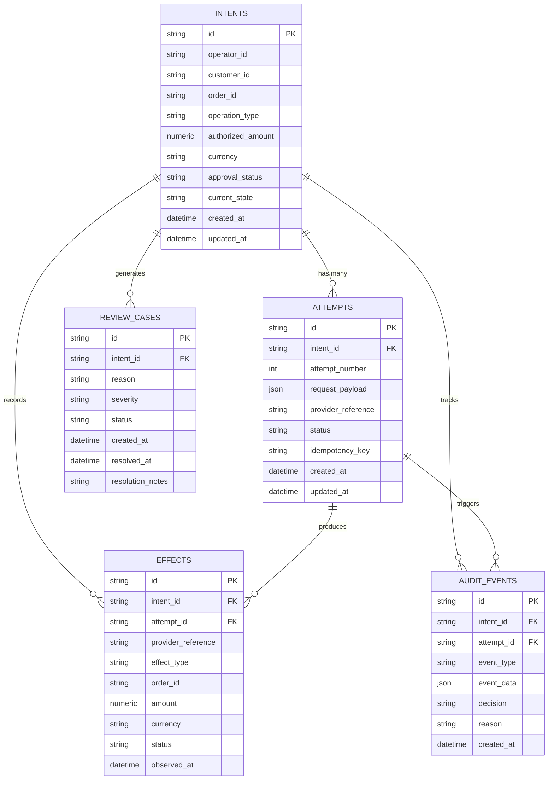

# 06. Database Design

## Entity-Relationship Schema & Persistence Architecture

IntentGuard implements an immutable, append-oriented relational data architecture. The schema strictly distinguishes between an authorized business intent (`intents`), individual execution attempts (`attempts`), observed external financial realities (`effects`), security decisions (`audit_events`), and exception handling (`review_cases`).

---

## 1. Relational Entity Overview

---

## 2. Table Specifications

### 2.1 `intents`
Represents the root durable authorization issued by a human operator or trusted source.
- `id` (VARCHAR(64), Primary Key): Business-unique intent identifier (e.g., `INT-001`).
- `operator_id` (VARCHAR(64)): Identifier of the human operator authorizing the intent.
- `customer_id` (VARCHAR(64), Indexed): Authorized customer recipient.
- `order_id` (VARCHAR(64), Indexed): Target business order identifier.
- `operation_type` (VARCHAR(32)): Permitted action (`REFUND`, `PAYMENT_AUTHORIZE`).
- `authorized_amount` (NUMERIC(12, 2)): Authorized monetary amount.
- `currency` (VARCHAR(3)): ISO-4217 currency code (e.g., `INR`, `USD`).
- `approval_status` (VARCHAR(32)): Current gateway authorization status.
- `current_state` (VARCHAR(32), Indexed): Current FSM state.
- `created_at` (TIMESTAMP): UTC timestamp of authorization creation.
- `updated_at` (TIMESTAMP): UTC timestamp of last state transition.

### 2.2 `attempts`
Represents an individual physical API request dispatched toward the payment provider.
- `id` (VARCHAR(64), Primary Key): Unique attempt ID (e.g., `ATT-001-1`).
- `intent_id` (VARCHAR(64), Foreign Key → `intents.id`): Parent intent.
- `attempt_number` (INTEGER): Monotonically increasing attempt index (1, 2, 3...).
- `request_payload` (JSON): Exact payload dispatched over the network.
- `provider_reference` (VARCHAR(128), Nullable, Indexed): External transaction identifier.
- `status` (VARCHAR(32)): Immediate attempt response status (`SUBMITTED`, `COMPLETED`, `UNKNOWN`, `FAILED`).
- `idempotency_key` (VARCHAR(128), Unique, Indexed): Deterministic key supplied to payment provider.
- `created_at` (TIMESTAMP): Timestamp of dispatch.
- `updated_at` (TIMESTAMP): Timestamp of last response.

### 2.3 `effects`
The ledger of verified external reality. Represents financial mutations observed on the payment service.
- `id` (VARCHAR(64), Primary Key): Internal effect record identifier.
- `intent_id` (VARCHAR(64), Foreign Key → `intents.id`): Associated intent.
- `attempt_id` (VARCHAR(64), Nullable, Foreign Key → `attempts.id`): Associated attempt.
- `provider_reference` (VARCHAR(128), Indexed): Provider's unique record identifier.
- `effect_type` (VARCHAR(32)): `REFUND`, `AUTHORIZATION`, `REVERSAL`.
- `order_id` (VARCHAR(64), Indexed): External order associated with the effect.
- `amount` (NUMERIC(12, 2)): Exact settled amount observed.
- `currency` (VARCHAR(3)): ISO currency code observed.
- `status` (VARCHAR(32)): Provider status (`COMPLETED`, `PENDING`, `CANCELLED`).
- `observed_at` (TIMESTAMP): UTC timestamp of observation.

### 2.4 `audit_events`
An immutable, append-only security journal of every gateway evaluation, decision, and transition.
- `id` (VARCHAR(64), Primary Key): UUID audit entry.
- `intent_id` (VARCHAR(64), Foreign Key → `intents.id`): Associated intent.
- `attempt_id` (VARCHAR(64), Nullable, Foreign Key → `attempts.id`): Associated attempt.
- `event_type` (VARCHAR(64)): `PROPOSAL_EVALUATION`, `CHECK_FAILED`, `RECONCILIATION_QUERY`, `STATE_TRANSITION`.
- `event_data` (JSON): Comprehensive contextual snapshot.
- `decision` (VARCHAR(32)): `APPROVED`, `BLOCKED`, `RECONCILE`, `ESCALATE`.
- `reason` (TEXT): Human-readable justification of the security decision.
- `created_at` (TIMESTAMP): Timestamp of event creation.

### 2.5 `review_cases`
Holds exceptions and indeterminate conditions requiring human operator intervention.
- `id` (VARCHAR(64), Primary Key): Review ticket identifier (e.g., `REV-001`).
- `intent_id` (VARCHAR(64), Foreign Key → `intents.id`): Disputed intent.
- `reason` (TEXT): Description of the irreconcilable discrepancy or failure.
- `severity` (VARCHAR(16)): `LOW`, `MEDIUM`, `HIGH`, `CRITICAL`.
- `status` (VARCHAR(32)): `OPEN`, `IN_REVIEW`, `RESOLVED`, `DISMISSED`.
- `created_at` (TIMESTAMP): Case opening timestamp.
- `resolved_at` (TIMESTAMP, Nullable): Case closure timestamp.
- `resolution_notes` (TEXT, Nullable): Human operator justification for manual resolution.
