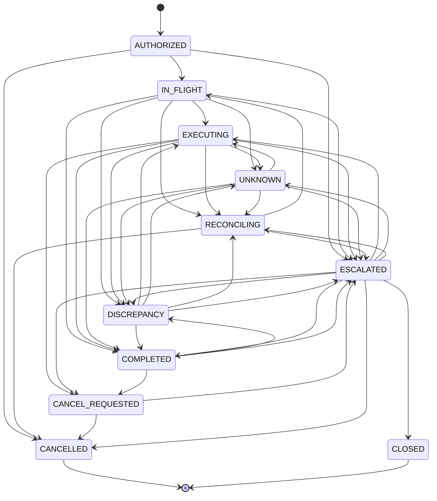

# Architecture (ARCHITECTURE.md) — IntentGuard Recovery

> **Status:** implemented on the simulated provider. Items marked *planned* are not built (real provider adapters, Redis, multi-tenancy, a hosted deployment).
> The as-built reference describes the code in detail: [architecture/overview.md](architecture/overview.md), [state machine](architecture/state-machine.md), [data model](architecture/data-model.md), [reconciliation](architecture/reconciliation.md), [API](architecture/api.md).
> Decisions are in [DECISIONS.md](DECISIONS.md).

## 1. System overview

IntentGuard Recovery is a middleware service between an application / AI agent and a payment provider. It owns submission, retry, cancellation and final resolution. The provider's observed effect is the source of truth.

**Core flow:** Authorization → Proposal → Validation → Execution → Observation → Reconciliation → Final Resolution

```
 Operator / App / Support ticket
              │
              ▼
   ┌─────────────────────┐
   │  AI Agent (UNTRUSTED)│  proposes {intent_id, customer_id, order_id, amount, currency, op}
   └──────────┬──────────┘
              ▼
 ┌────────────────────────────────────────────────────────────┐
 │                  IntentGuard Gateway (TRUSTED)             │
 │  decide    checks vs. intent + ledger (locked)             │
 │  reserve   attempt + stable idempotency key → IN_FLIGHT    │
 │  execute   provider call (no DB lock held)                 │
 │  verify    read back provider transaction                  │
 │  absorb    record effect, derive intent state from ledger  │
 │  drive     reconcile · recover · retry · escalate          │
 └───────┬───────────────────────────┬────────────────────────┘
         │                           │
         ▼                           ▼
 ┌──────────────┐          ┌──────────────────────────┐
 │  PostgreSQL  │          │ Provider Port            │
 │  (or SQLite) │          │  ├ paysim (simulator)    │
 │  ledger+audit│          │  ├ Stripe test (planned) │
 └──────────────┘          │  └ Razorpay   (planned)  │
         ▲                 └─────────┬────────────────┘
         │                           │ webhooks (signed)
 ┌───────┴────────┐                  ▼
 │ Exception      │◄──── Reconciliation worker
 │ Investigator   │      (matches orders, payments, refunds, events)
 │ (LLM, advisory)│
 └───────┬────────┘
         ▼
   Review queue ──► Operator Dashboard (React)
```

## 2. Layers

| Layer | Responsibility | Trust |
|-------|----------------|-------|
| **Client layer** | Operator dashboard, integrating apps, AI agents | Untrusted input |
| **API layer** | FastAPI routers (`backend/gateway_api`), JWT auth and role/scope checks, strict request validation (Pydantic v2), rate limits, client idempotency | Trusted boundary |
| **Gateway engine** | Checks, state machine, idempotency, attempt control | Trusted, deterministic |
| **Recovery layer** | Reconciliation worker, webhook ingestion, state-aware recovery, retry policy | Trusted, deterministic |
| **Exception investigator** | Classification + evidence summary (offline rules by default, or an LLM); advisory only (`backend/investigator`) | Untrusted output, policy-gated |
| **Provider port/adapters** | Common interface over providers; fault injection in sim | Trusted code, untrusted responses |
| **Persistence** | PostgreSQL ledger, append-only audit log | Source of durable truth |
| **Coordination (optional, planned)** | Redis for short-lived locks/queues; PostgreSQL stays authoritative. Not used: the worker runs in the gateway process | Non-authoritative |

## 3. Key design rules (invariants)

1. The agent **never** holds provider credentials or a network route to the provider.
2. Only the gateway submits, retries, cancels or finalizes.
3. Decisions and attempts are persisted **before** any external call.
4. Four identities stay separate: **intent** (operator authorization), **proposal** (agent request), **attempt** (one provider call), **effect** (observed at provider). Intent state is *derived* from attempts and effects, never asserted.
5. One stable provider idempotency key per intent generation: `ig-<intent_id>-g<generation>`. Generation increments only after a verified reversal.
6. A timeout yields `UNKNOWN`; no retry until reconciliation finds evidence. If the provider cannot be queried, hold for review.
7. "Not found" is evidence of absence only after `absence_window_s` (eventually consistent search).
8. Internal recovery (restoring agent memory, restarting) is never proof an external effect was reversed.
9. The LLM may classify and summarize; the policy gate decides what is permitted.
10. Audit log is append-only and hash-chained; entries are never rewritten.

## 4. State model

The authoritative transition table lives in code (`backend/intentguard/domain.py`, `TRANSITIONS`). The diagram below is generated from it; regenerate it rather than editing by hand. The [as-built state machine page](architecture/state-machine.md) explains every state and transition.



- **Proposal status.** Each proposal has a `ProposalStatus` of `PROPOSED`, `VALIDATED`, `REJECTED` or `BLOCKED`. It is not an intent state (ADR-029): a rejected proposal leaves the intent `AUTHORIZED`.
- **The dashboard pipeline.** It reads `Authorized → Proposed → Validated → Executing → Outcome`. It combines the latest proposal's status with the intent state, and shows `UNKNOWN`/`RECONCILING` as "Verifying".
- **Cancellation** (ADR-030): `CANCEL_REQUESTED` leads to `CANCELLED` once the provider shows the effect cancelled, or to `ESCALATED` when the provider refuses.
- **`DISCREPANCY`**: a live effect does not match the authorization and is being remediated.
- **`CLOSED`**: a reviewer closed the case without the authorized effect.

## 5. Data flow

### 5.1 Happy path
1. Operator creates authorization → intent `AUTHORIZED`.
2. Agent/app posts proposal.
3. Gateway runs checks under lock; on pass, creates attempt, sets `IN_FLIGHT`.
4. Provider call (stable idempotency key).
5. Gateway reads back the provider transaction, records an `effect`, derives `COMPLETED`.

### 5.2 Lost response
1–4 as above; response lost → attempt `UNKNOWN` → reconcile: query by provider txn ID, then by order reference → compare customer, amount, currency, operation → effect found → `COMPLETED`. No second call.

### 5.3 Restart / new request ID
Same business request arrives with a new `request_id` → mapped to existing intent → `DUPLICATE` decision; no new attempt.

### 5.4 Discrepancy
Provider shows a live effect not matching the authorization (wrong amount, order or customer, or a duplicate) → intent `DISCREPANCY`. Recovery is state-aware (ADR-024): a pending refund is cancelled and a hold voided, and each is read back before it counts as reversed. A completed refund, a refused cancel, or one that cannot be verified opens a `review_case` with the amount at stake → `ESCALATED`.

### 5.5 Exception investigation
On demand, for an intent in an exception state: build the evidence bundle (attempts, effects, provider lookups, webhook events, ledger rows, redacted) → the classifier returns `{classification, summary, recommended_action}` under a strict schema → the policy gate checks the action against the current facts → the verdict is stored. An operator may then apply a permitted recommendation; applying re-checks the gate on fresh evidence and uses the engine's own operations (ADR-033).

### 5.6 Webhooks
Signed provider event → verify signature and timestamp tolerance → dedupe by event ID → store → **re-fetch** the transaction from the provider → feed reconciliation (ADR-021).
- Because state comes from the re-fetch, never from the payload, out-of-order and repeated delivery are harmless.
- A transaction no intent accounts for becomes a `MISSING` mismatch.

### 5.7 Reconciliation runs
- The **worker** runs in the gateway process and drives due intents (reconcile, recover, retry, escalate). Each pass that processed at least one intent is recorded as a `WORKER` run.
- A **matching** run, triggered from the dashboard or `POST /reconciliation/runs`, compares orders, refunds, holds and effects with the provider. It records `MISSING`, `DUPLICATE`, `AMOUNT`, `ORDER` and `CUSTOMER` mismatches, and changes nothing.

## 6. Data model (summary)

Schema version 2, in `backend/intentguard/models.py`. Details: [architecture/data-model.md](architecture/data-model.md).

| Table | Purpose |
|-------|---------|
| `users` | operators, reviewers, admins, agent principals; role, permitted operations, limit, lockout |
| `refresh_tokens`, `service_tokens` | hashed rotating refresh tokens (family revocation); issued agent tokens (revocable by `jti`) |
| `orders` | orders the gateway knows (customer, currency, value) |
| `intents` | the operator authorization: binding, `approval_status`, derived state, key generation, cancel request |
| `agent_proposals` | every proposal including `request_id`, with its `ProposalStatus` |
| `gateway_decisions` | one decision + findings (reason codes) per proposal |
| `transaction_attempts` | one row per provider call: key, status, lease, provider reference |
| `effects` | observed provider effects (unique per provider transaction), classification, remediation |
| `review_cases` | reason, amount at stake, status, resolution |
| `webhook_events` | verified events, unique per provider and event id, delivery count, outcome |
| `reconciliation_runs`, `mismatches` | worker and matching runs; mismatches with a fingerprint and status |
| `investigations` | classification, evidence refs, recommended action, policy verdict, applied outcome |
| `policies`, `provider_configs` | admin settings kept across restarts (provider secret write-only) |
| `api_idempotency` | stored responses for client `Idempotency-Key` replay |
| `counters`, `schema_meta` | identifier sequences (INT-, ATT-); schema version |
| `audit_logs` | append-only, hash-chained per intent plus a system chain |

DB-level guarantees (ADR-025):
- at most one counted effect per intent (partial unique index);
- one effect row per provider transaction;
- unique attempt numbers per intent;
- unique webhook events;
- the audit table protected by triggers against UPDATE/DELETE, on SQLite and PostgreSQL.

## 7. Deployment topology

| Component | Dev | Production-like |
|-----------|-----|-----------------|
| Gateway API | uvicorn :8000 | container (non-root) behind a TLS proxy *(proxy planned)* |
| Provider | paysim API :8001 | paysim container; real provider **test mode** *(planned)* |
| Database | SQLite | PostgreSQL 16 (`docker-compose.yml`) |
| Worker | in-process task in the gateway | the same; a separate process and Redis are *planned* if throughput needs them |
| Frontend | Vite dev server on 127.0.0.1:3000 | static build served by unprivileged nginx with security headers (`docker compose`: http://localhost:3000) |

`start.bat` runs the dev column on Windows; `docker compose up --build` runs the production-like column with the simulator. See [operations/running.md](operations/running.md).

## 8. Repository layout

The system coordinates across a backend and a frontend; the contract between them is `API.md`.

### Monorepo (as built)
```
intentguard/
├── backend/
│   ├── intentguard/        # protocol core: domain, checks, engine, models, audit, providers/, agents/
│   ├── gateway_api/        # FastAPI gateway: routers/, security, webhooks, reconciliation runs, seed
│   ├── investigator/       # evidence bundle, classifiers (offline rules / LLM), policy gate
│   ├── provider_api/       # simulator HTTP service (+ signed webhook emitter)
│   ├── paysim/             # provider simulator + fault injection
│   ├── tests/              # 127 tests; also run against PostgreSQL in CI
│   └── requirements.txt
├── frontend/
│   ├── src/
│   │   ├── api/            # HTTP client + one route table, checked against docs/api/openapi.json
│   │   ├── components/     # pipeline, timeline, status pills, demo scenario cards, widgets
│   │   ├── pages/          # Login, Overview, Intents, IntentDetail, Exceptions, Reviews,
│   │   │                   # Reconciliation, Audit, Experiments, Admin
│   │   ├── hooks/          # auth session, polling
│   │   └── styles/         # tokens from DESIGN.md, app styles
│   ├── scripts/check-contract.mjs
│   └── package.json
├── experiments/
│   ├── bench/
│   └── results/
├── docs/                   # target specs (this folder's root) + as-built reference (subfolders)
├── scripts/                # launchers, init_env, check_db, export_openapi, check_bench_safety
└── .github/workflows/ci.yml
```
*Planned:* `backend/intentguard/providers/` gains real sandbox adapters (Stripe or Razorpay test mode), and a `deploy/` folder for a hosted setup.

### Split-repo option
If backend and frontend become separate repositories, `API.md` (plus the generated OpenAPI file) is the only coordination surface; version it and publish it from the backend repo.

## 9. Technology stack

| Concern | Choice |
|---------|--------|
| Backend | Python 3.12+, FastAPI, Pydantic v2, pydantic-settings |
| Auth | PyJWT (HS256), argon2-cffi (argon2id) |
| ORM / DB | SQLAlchemy 2.0; SQLite (dev), PostgreSQL 16 (compose, CI) |
| Jobs | In-process background worker; Redis + Celery only when needed (*planned*, not used) |
| LLM | Gemini / OpenAI-compatible / Ollama behind one interface; offline rule extractor and rule classifier as defaults |
| Frontend | React 18, Vite 7, Recharts, lucide-react, self-hosted fonts |
| Tests | pytest, Hypothesis, Vitest, route contract check, seeded benchmark with a CI safety gate |
| Containers | Docker Compose (non-root images) |
| CI | GitHub Actions: ruff, SQLite + PostgreSQL suites, OpenAPI drift, frontend, benchmark gate, gitleaks, pip-audit, `npm audit`, image build |

No orchestration framework in v1; a plain service, an explicit state machine and a constrained LLM call are sufficient.

## 10. Quality attributes

| Attribute | Approach |
|-----------|----------|
| Safety | Deterministic gate; LLM advisory; provider-verified outcomes |
| Durability | Persist-before-call; crash recovery marks `SUBMITTING` attempts `UNKNOWN` on startup |
| Auditability | Hash-chained append-only log; evidence reference on every recovery action |
| Observability | Metrics summary endpoint (with metric definitions), per-intent timeline, live console, request ids on every response; alerting is *planned* |
| Honest limits | Effectively-once where provider semantics support it; no universal exactly-once claim |
