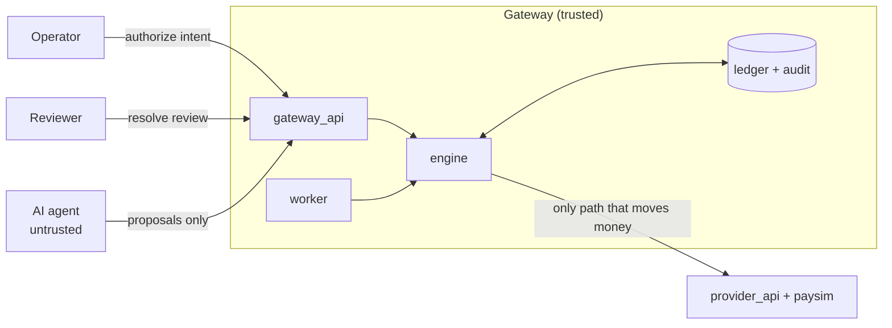

# Architecture overview

Diagram: [../diagrams/intentguard_architecture.mmd](../diagrams/intentguard_architecture.mmd)
(also as [HTML](../diagrams/intentguard_architecture.html) and
[PNG](../diagrams/intentguard_architecture.png)).

## Components

| Component | Path | Runs as | Role |
|---|---|---|---|
| Protocol core | `backend/intentguard/` | library | Domain model and state machine, gateway checks, engine, ledger models, audit log, provider port and adapters, ticket→proposal agents |
| Gateway service | `backend/gateway_api/` | FastAPI on :8000 | HTTP API, background reconciliation worker, crash recovery on startup, demo seed data |
| Provider service | `backend/provider_api/` | FastAPI on :8001 | Exposes the simulator as a mock payment provider |
| Simulator | `backend/paysim/` | library | Payment-provider behaviour and fault injection |
| Dashboard | `frontend/` | Vite dev server on :3000, or nginx in Docker | React UI; calls the gateway through `/api` (proxied by Vite or nginx) |
| Benchmark | `experiments/bench/` | CLI (`python -m bench`) | Seeded scenarios, arms, oracle, report |
| Database | SQLite file by default, PostgreSQL in Docker | | Intents, proposals, attempts, effects, review cases, audit events |

Layers inside `backend/intentguard/`:

| Layer | Modules | Responsibility |
|---|---|---|
| Domain | `domain.py`, `money.py` | States, decisions, legal transitions, cancellation policy; money as integer minor units |
| Rules | `checks.py` | Pure functions that evaluate a proposal against a snapshot of durable state |
| Engine | `engine.py` | decide → reserve → execute → verify → absorb → drive; worker tick; startup recovery; review resolution |
| Storage | `models.py`, `db.py`, `audit.py` | Tables and database-enforced constraints; transaction setup; hash-chained audit log |
| Ports/adapters | `providers/base.py`, `http.py`, `inprocess.py` | The `PaymentProvider` protocol; HTTP adapter for `provider_api`; in-process adapter around `paysim` |
| Agents | `agents/extraction.py`, `agents/llm.py` | Deterministic ticket extractor; optional LLM extractor (OpenAI-compatible or Gemini) |
| Configuration | `config.py` | `ProtocolConfig`: one boolean per safeguard (used for ablations) plus protocol parameters |

The engine depends only on the `PaymentProvider` protocol. It never imports `paysim`.

## Trust boundary



- The agent has no provider credentials, URL or adapter. It can only call the gateway's proposal
  and agent endpoints.
- Only the engine calls the provider, and only with parameters taken from a recorded attempt.
- Nothing the agent or a provider response *claims* changes intent state directly. State is
  derived from what the gateway recorded and what it read back from the provider.

Details and assumptions: [../security/threat-model.md](../security/threat-model.md).

## Request flow

```
1. decide   (locked)    evaluate checks against the intent, operator, order and effects ledger; record the proposal + decision
2. reserve  (same tx)   create an attempt (status SUBMITTING, key ig-<intent>-g<generation>); intent -> IN_FLIGHT
3. execute  (no lock)   provider.create(...) with intent_id / attempt_id metadata
4. verify   (no lock)   provider.get(provider_ref): read the transaction back
5. absorb   (locked)    record the effect, classify it (INTENDED / DUPLICATE / MISMATCH), derive the intent state
6. drive                OUTCOME_UNKNOWN / PENDING_SETTLEMENT -> reconcile; DISCREPANCY -> recover; RETRYABLE -> controlled retry
```

Provider I/O never happens while a database lock is held. "Locked" means: on SQLite every unit of
work starts with `BEGIN IMMEDIATE`; on PostgreSQL the intent row is read with
`SELECT … FOR UPDATE` (`backend/intentguard/db.py`).

Outcome of step 3:

| Provider result | Attempt status | Next |
|---|---|---|
| Transaction returned | `ACKNOWLEDGED` | absorb the read-back record |
| Definitive rejection (4xx) | `REJECTED` | intent becomes `RETRYABLE`; the agent may re-propose |
| Timeout, lost response (504), 5xx, network error | `UNKNOWN` | reconcile ([reconciliation.md](reconciliation.md)) |

## Gateway checks

`backend/intentguard/checks.py`. All checks run; the decision is the first of
`REJECTED > HELD > IN_PROGRESS > DUPLICATE` that any finding produced, else `APPROVED`.

| Check | Decision | Fires when |
|---|---|---|
| `OPERATOR_NOT_PERMITTED` | REJECTED | The authorizing operator is unknown, inactive, or no longer permitted for this operation or amount (re-checked at proposal time) |
| `OPERATION_MISMATCH`, `CUSTOMER_MISMATCH`, `ORDER_MISMATCH`, `CURRENCY_MISMATCH`, `AMOUNT_MISMATCH` | REJECTED | The proposal's field differs from the intent |
| `BALANCE_EXCEEDED` | REJECTED | Proposed amount + live effects of the same operation on the order from *other* intents > the order value |
| `INTENT_NOT_ACTIVE` | REJECTED | Intent is `REVOKED` or `CLOSED` |
| `HELD_FOR_REVIEW` | HELD | Intent is `NEEDS_REVIEW` |
| `ALREADY_FULFILLED` | DUPLICATE | A live intended effect exists, or the intent is `COMPLETED` / `PENDING_SETTLEMENT` |
| `ATTEMPT_IN_PROGRESS` | IN_PROGRESS | Intent is `IN_FLIGHT`, `OUTCOME_UNKNOWN` or `DISCREPANCY` |
| `ATTEMPT_BUDGET_EXHAUSTED` | HELD | `attempt_count` ≥ `max_attempts` (3) |

The state checks (`INTENT_NOT_ACTIVE` to `ATTEMPT_BUDGET_EXHAUSTED`) are evaluated in the order
listed and only the first one applies. The mismatch and balance checks are switched off by the
`intent_binding` ablation; the state checks by the `effect_dedup` ablation, except
`INTENT_NOT_ACTIVE`, which always applies.

`IntentGuard.authorize` validates the intent itself when it is created (HTTP 422 on failure):
operator active, permitted for the operation, amount within the operator's limit; order known to
the merchant and owned by the customer; currency equal to the order's; `0 < amount ≤ order value`.

## Background worker and restart

- `worker_loop` in `backend/gateway_api/main.py` calls `IntentGuard.tick()` every `WORKER_INTERVAL_S`
  (2 s). `tick` processes intents whose `next_check_at` is due: it reconciles, then drives them.
- Polling backs off while nothing changes: the next check is
  `max(poll_interval_s, min(max_poll_interval_s, 0.5 × seconds since the last state change))`
  (5 s to 60 s by default).
- After an intent completes with more than one attempt or any attempt error, it is watched for late-visible
  duplicates for `2 × absence_window_s`.
- On startup, `startup_recovery` marks attempts left `SUBMITTING` by a previous process
  (different `incarnation`) as `UNKNOWN` and reconciles them. A `SUBMITTING` attempt older than
  its lease (`submit_lease_s`, 15 s) is also treated as `UNKNOWN`.

## Configuration

Gateway settings are read by pydantic-settings in `backend/gateway_api/settings.py` from the
environment, the repository-root `.env`, and a `.env` in the working directory (which wins).

| Variable | Default | Used by |
|---|---|---|
| `DATABASE_URL` | `sqlite:///./intentguard_gateway.db` (relative to the working directory) | gateway |
| `PAYMENT_PROVIDER` | `http` (`inprocess` embeds the simulator in the gateway) | gateway |
| `PAYMENT_SERVICE_URL` | `http://127.0.0.1:8001` | gateway |
| `PROVIDER_TIMEOUT_S` | `5` | gateway |
| `ABSENCE_WINDOW_S`, `MAX_ATTEMPTS`, `UNKNOWN_REVIEW_AFTER_S`, `POLL_INTERVAL_S` | `30`, `3`, `300`, `5` | gateway → `ProtocolConfig` |
| `WORKER_INTERVAL_S` | `2` | gateway worker |
| `DEMO_SEED` | `true`: seeds operators `op-asha`, `op-ravi` and orders `ORD-204`, `ORD-240`, `ORD-2041`, `ORD-311` on first start | gateway |
| `RESULTS_DIR` | `<repo>/experiments/results` | gateway `/api/experiments/latest` |
| `CORS_ORIGINS` | `http://localhost:3000,http://127.0.0.1:3000` | gateway |
| `PAYSIM_STATE_PATH`, `PAYSIM_SETTLE_DELAY_S` | `paysim_state.json`, `3` | provider (read with `os.getenv`) |
| `LLM_PROVIDER`, `LLM_MODEL`, `OPENAI_API_KEY`, `OPENAI_BASE_URL`, `GEMINI_API_KEY`, `OLLAMA_BASE_URL` | `offline` | agent endpoint and `--llm-reviewer` (read with `os.getenv`) |

The provider and LLM variables are read with `os.getenv`, so a value in `.env` has no effect on
them. Export them in the shell (or set them in `docker-compose.yml`) instead. This is tracked in
[TASKS.md](../../TASKS.md).
