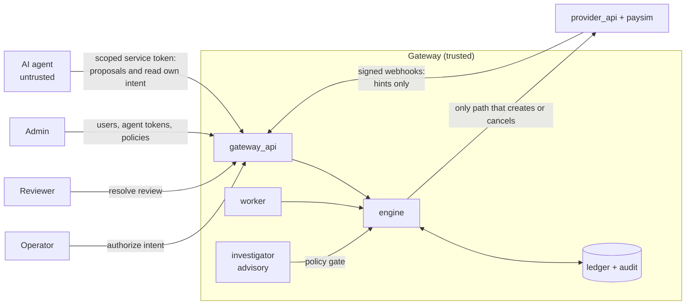

# Architecture overview (as built)

This page describes the components and request flow as they are in the code. The target
architecture is [docs/ARCHITECTURE.md](../ARCHITECTURE.md). IntentGuard is a research prototype:
the only payment provider it talks to is the simulator in `backend/paysim/`.

Related as-built pages: [state-machine.md](state-machine.md) (every intent state and transition),
[reconciliation.md](reconciliation.md) (unknown outcomes, the absence window, recovery),
[data-model.md](data-model.md) (tables and constraints), [api.md](api.md) (every endpoint),
[../security/threat-model.md](../security/threat-model.md).

Diagram: [../diagrams/intentguard_architecture.mmd](../diagrams/intentguard_architecture.mmd)
(also as [HTML](../diagrams/intentguard_architecture.html) and
[PNG](../diagrams/intentguard_architecture.png)).

## Components

| Component | Path | Runs as | Role |
|---|---|---|---|
| Protocol core | `backend/intentguard/` | library | Domain model and state machine, gateway checks, engine, ledger models, audit log, provider port and adapters, ticket extractors |
| Gateway service | `backend/gateway_api/` | FastAPI on :8000 | HTTP API under `/api`, authentication and RBAC, client idempotency, webhook receiver, reconciliation runs, background worker, startup recovery, first-start seed |
| Investigator | `backend/investigator/` | library used by the gateway | Evidence bundles, classifiers (offline rules or an LLM), the deterministic policy gate, investigate and apply |
| Simulator | `backend/paysim/` | library | Payment-provider behaviour, fault injection, signed webhook emitter |
| Provider service | `backend/provider_api/` | FastAPI on :8001 | Exposes the simulator as a mock payment provider over HTTP |
| Dashboard | `frontend/` | Vite dev server on 127.0.0.1:3000, or nginx in Docker | React UI; calls the gateway through `/api` (proxied by Vite or nginx) |
| Benchmark | `experiments/bench/` | CLI (`python -m bench`) | Seeded scenarios, 15 arms, oracle, report. Runs the engine in-process on a simulated clock |
| Database | SQLite file by default, PostgreSQL 16 in Docker | | Users, tokens, orders, intents, proposals, decisions, attempts, effects, review cases, webhook events, runs, mismatches, investigations, policies, audit log |

### Inside `backend/intentguard/`

| Layer | Modules | Responsibility |
|---|---|---|
| Domain | `domain.py`, `money.py` | Intent states and legal transitions, decisions, proposal, attempt, effect and review enums, cancellation policy; money as integer minor units |
| Rules | `checks.py` | Pure functions that evaluate a proposal against a snapshot of durable state |
| Engine | `engine.py` | authorize; decide, reserve, execute, verify, absorb, drive; reconcile, recover, controlled retry; cancel; worker tick; startup recovery; review resolution; `observe` for webhooks |
| Storage | `models.py`, `db.py`, `audit.py` | Tables (schema version 2) and database-enforced constraints; transaction setup and the schema-version check; hash-chained audit log |
| Ports and adapters | `providers/base.py`, `providers/http.py`, `providers/inprocess.py` | The `PaymentProvider` protocol; HTTP adapter for `provider_api`; in-process adapter around `paysim` |
| Agents | `agents/extraction.py`, `agents/llm.py` | Deterministic ticket extractor; optional LLM extractor (OpenAI-compatible, which covers Ollama, or Gemini) and the `LLMClient` the investigator uses |
| Configuration | `config.py`, `envfile.py`, `clock.py` | `ProtocolConfig` (one boolean per safeguard, used for ablations, plus protocol parameters); `.env` loading; system and simulated clocks |

The engine depends only on the `PaymentProvider` protocol and never imports `paysim`. Only the
in-process adapter does.

### Inside `backend/gateway_api/`

| Module | Responsibility |
|---|---|
| `main.py` | App setup: request-id and security-header middleware, CORS, routers. Startup: JWT secret check, schema init, provider adapter, stored policies and provider config, seed, startup recovery, worker loop |
| `security.py` | Password hashing (argon2id), JWTs, rotating refresh tokens, rate limiter, principals, `CAPABILITIES`, `require(...)` |
| `routers/` | `auth`, `intents`, `recovery`, `reviews`, `webhooks`, `observability`, `admin`, `system` (health, readiness, simulator-only `/dev`) |
| `schemas.py`, `serializers.py`, `errors.py`, `pagination.py`, `idempotency.py` | Strict request models, response shapes and redaction, the error envelope, cursor pagination, client `Idempotency-Key` replay |
| `webhooks.py` | Verify the signature, store each event once, re-fetch the transaction through the engine |
| `reconciliation.py` | Records worker runs; matching runs that compare the provider with the ledger and report mismatches |
| `seed.py` | Demo users and orders (`DEMO_SEED`), or a bootstrap admin |
| `settings.py` | Settings from the environment and `.env` |

## Trust boundary



- **Agents only propose.** An agent is a service principal (`role = agent`) with no password and no
  role capabilities. An admin issues it a short-lived token (at most 300 s, revocable by `jti`)
  scoped to intent ids or customer ids. With it the agent can submit proposals for those intents
  and read them, nothing else. A proposal is checked against the operator's durable authorization;
  the agent cannot choose the provider idempotency key, retry, cancel or resolve anything.
- **The agent has no route to money.** It holds no provider credentials, URL or adapter. The
  gateway is the only component configured with the provider (`PAYMENT_SERVICE_URL`, or the
  connection stored with `PUT /admin/providers/paysim`).
- **Nothing reaches the provider except through the engine.** Every call that creates or cancels a
  provider transaction is made by the engine (`_execute`, `recover`), with parameters from a
  recorded attempt or a re-read effect. Other code only reads: the matching run and the
  investigator's evidence bundle look transactions up, and webhook processing goes through
  `engine.observe`, which re-fetches. Order registration (`POST /v1/orders`) and the simulator-only
  fault and ledger endpoints are the only other provider calls.
- **LLMs are untrusted functions.** The extractor turns ticket text into proposal fields, which are
  then checked like any other proposal. The investigator recommends one action from a fixed set; a
  deterministic gate decides, and applying re-checks the gate on fresh evidence. Neither has tools.
- **State comes from the ledger.** Intent state is derived from the effects the engine recorded
  from provider read-backs and lookups. Nothing an agent sends, and no webhook payload, sets state
  directly.

Humans authenticate with email and password. The user who creates an authorization is the intent's
operator. With the separation-of-duties policy on (the default), that user cannot resolve the
intent's review case. Details: [../security/threat-model.md](../security/threat-model.md).

## Request flow

The life of a proposal (`IntentGuard.submit` in
[`backend/intentguard/engine.py`](../../backend/intentguard/engine.py)):

```
1. decide   (locked)    evaluate checks against the intent, its operator, the order, the effects ledger and
                        the policies; record the proposal (status VALIDATED, REJECTED or BLOCKED) and the decision
2. reserve  (same tx)   on ALLOW: attempt ATT-nnn with status SUBMITTING, key ig-<intent>-g<generation>,
                        lease submit_lease_s (15 s); intent -> IN_FLIGHT
3. execute  (no lock)   provider.create(...) with metadata {intent_id, attempt_id}
4. verify   (no lock)   provider.get(...): read the transaction back
5. absorb   (locked)    record the effect, classify it INTENDED / DUPLICATE / MISMATCH, derive the intent state
6. drive                UNKNOWN / EXECUTING -> reconcile; DISCREPANCY / CANCEL_REQUESTED -> recover;
                        RECONCILING -> controlled retry if allowed
```

Steps 1 and 2 run in one transaction under the intent lock. The `serialize_intent` ablation splits
them. Provider I/O never happens while a database lock is held. "Locked" means: on SQLite every
unit of work starts with `BEGIN IMMEDIATE`; on PostgreSQL the intent row is read with
`SELECT ... FOR UPDATE` ([`backend/intentguard/db.py`](../../backend/intentguard/db.py)).

Outcome of step 3:

| Provider result | Attempt status | Next |
|---|---|---|
| Transaction returned | `SUCCEEDED` | Absorb the read-back record |
| Definitive rejection (4xx) | `FAILED` | Intent becomes `RECONCILING`. No automatic retry; a new proposal is accepted while the attempt budget lasts |
| Timeout, lost response (504), 5xx, network error | `UNKNOWN` | Reconcile ([reconciliation.md](reconciliation.md)) |

How the intent state is derived from the ledger (`_derive`, first match wins):

| Condition | State |
|---|---|
| Already `CANCELLED` or `CLOSED` | Unchanged (terminal) |
| An open review case | `ESCALATED` |
| A cancel was requested | `CANCEL_REQUESTED` while any live effect remains, else `CANCELLED` |
| A live effect that is not the intended one and not remediated | `DISCREPANCY` |
| The intended effect is live | `COMPLETED` if the provider says `COMPLETED`, else `EXECUTING` |
| An attempt is `UNKNOWN` | `UNKNOWN` |
| An attempt is `SUBMITTING` | `IN_FLIGHT` |
| Attempts exist | `RECONCILING` |
| No attempts | `AUTHORIZED` |

Every state change is checked against `TRANSITIONS` ([state-machine.md](state-machine.md)) and
written to the audit log.

What the drive step does:

- **Reconcile.** Look up every known provider transaction by id. When an attempt is unresolved, or
  the intent is in its post-completion watch period, also search the order's transactions by
  intent id, attempt id or idempotency key. Then absorb what was found.
  - A `SUBMITTING` attempt past its lease becomes `UNKNOWN`.
  - An `UNKNOWN` attempt becomes `RECONCILED` (verified absent) only after a successful search, once
    `absence_window_s` (30 s) has passed since the attempt was created.
  - An intent `UNKNOWN` for longer than `unknown_review_after_s` (300 s) gets an
    `UNRESOLVABLE_OUTCOME` review case.
- **Recover.** Every live effect that must not stand is re-read: unintended effects in
  `DISCREPANCY`, all live effects in `CANCEL_REQUESTED`. Where the provider allows it (a pending
  refund; a pending or authorized hold), the gateway cancels the effect and reads it back. Only a
  verified `CANCELLED` counts. When the reversed effect came from one of the intent's attempts,
  the key generation advances, so a retry cannot replay it. Otherwise a review case is
  opened: `IRREVERSIBLE_DISCREPANCY`, `CANCEL_REJECTED`, or `CANCEL_UNVERIFIED` after
  `max_cancel_tries` (3).
- **Controlled retry.** Only from `RECONCILING`, and only when the last attempt is `RECONCILED`
  (verified absent) or its effect was verifiably reversed. Within `max_attempts` (3) the gateway
  reserves and executes a new attempt itself; at the limit it opens an `ATTEMPT_BUDGET_EXHAUSTED`
  review case.

## Gateway checks

[`backend/intentguard/checks.py`](../../backend/intentguard/checks.py). All checks run, and every
finding is returned. The decision is the first of `REJECT > HOLD_FOR_REVIEW > DUPLICATE` that any
finding produced, else `ALLOW`.

| Check | Decision | Fires when |
|---|---|---|
| `OPERATOR_NOT_PERMITTED` | REJECT | The authorizing operator is unknown or inactive, or no longer permitted for this operation or amount (re-checked at proposal time) |
| `POLICY_LIMIT_EXCEEDED` | REJECT | The intent's amount exceeds the admin `max_amount` policy (off by default) |
| `OPERATION_MISMATCH`, `CUSTOMER_MISMATCH`, `ORDER_MISMATCH`, `CURRENCY_MISMATCH` | REJECT | The proposal's field differs from the intent |
| `AMOUNT_EXCEEDS_AUTHORIZATION`, `AMOUNT_BELOW_AUTHORIZATION` | REJECT | The proposed amount is above or below the authorized amount; it must match exactly |
| `EXCEEDS_REMAINING_BALANCE` | REJECT | Proposed amount plus live effects of the same operation on the order from *other* intents exceeds the order value |
| `INTENT_NOT_ACTIVE` | REJECT | The intent is `CANCELLED`, `CLOSED` or `CANCEL_REQUESTED` |
| `HELD_FOR_REVIEW` | HOLD_FOR_REVIEW | The intent is `ESCALATED` |
| `ALREADY_COMPLETED` | DUPLICATE | A live intended effect exists, or the intent is `COMPLETED` or `EXECUTING` |
| `ATTEMPT_IN_PROGRESS` | DUPLICATE | The intent is `IN_FLIGHT`, `UNKNOWN` or `DISCREPANCY` |
| `ATTEMPT_BUDGET_EXHAUSTED` | HOLD_FOR_REVIEW | `attempt_count` is at least `max_attempts` (3) |
| `KILL_SWITCH` | HOLD_FOR_REVIEW | The admin kill switch is on (off by default) |

The state checks (`INTENT_NOT_ACTIVE` to `ATTEMPT_BUDGET_EXHAUSTED`) are evaluated in the order
listed and only the first one applies. The ablations switch groups off:

- `intent_binding` turns off the mismatch, amount and balance checks;
- `effect_dedup` turns off the state checks, except `INTENT_NOT_ACTIVE`, which always applies.

`IntentGuard.authorize` validates the intent itself when it is created, and refuses it with HTTP
422:

- the operator must be active and permitted the operation; the amount must be within the
  operator's limit and the policy maximum;
- the order must be known to the merchant and owned by the customer, with the same currency;
- the amount must satisfy `0 < amount <= order value`.

## Other flows

**Cancel** (`POST /intents/{id}/cancel`, `engine.cancel`).

- `AUTHORIZED` or `RECONCILING`: `CANCELLED` at once.
- `IN_FLIGHT` or `UNKNOWN`: refused until the outcome is known (`409 ATTEMPT_IN_PROGRESS`).
- A completed refund: refused (`409 NOT_CANCELLABLE`).
- A pending refund, or a pending or authorized hold: `CANCEL_REQUESTED`, then recovery cancels it
  at the provider and verifies the result. The intent becomes `CANCELLED`, or `ESCALATED` if the
  provider refuses or the cancellation cannot be verified.

**Exceptions and the investigator** (`backend/investigator/`). Investigations are opened only for
intents in `UNKNOWN`, `RECONCILING`, `DISCREPANCY`, `CANCEL_REQUESTED` or `ESCALATED`.

1. `evidence.py` builds a bundle from the ledger plus a fresh read-only provider lookup. The facts
   the gate uses are computed by code. Provider idempotency keys and secrets are left out; the
   ticket is truncated to 500 characters and marked untrusted.
2. `classifier.py` returns `{classification, summary, evidence_refs, recommended_action}`. Without
   an LLM the deterministic `OfflineClassifier` does this. The `LLMClassifier` uses a fixed prompt
   that passes the evidence as delimited data. Its output is rejected, never repaired, if it fails
   the strict schema or cites a reference that is not in the bundle.
3. `policy.py` (the gate) decides whether the action is permitted in the current state.
4. Applying an investigation re-builds the bundle and re-runs the gate first. It then uses the same
   engine paths as the worker: `observe` for `MARK_COMPLETED`, a scheduled re-check for
   `WAIT_AND_RECHECK`, `retry_now` for `CONTROLLED_RETRY`, `recover` for `CANCEL_PENDING`, and a
   review case for `ESCALATE`.

**Webhooks.** With `PAYSIM_WEBHOOK_URL` and a secret set, the provider posts signed status-change
events to `POST /api/webhooks/paysim`. The gateway first verifies the HMAC and the timestamp, then
stores each event once per provider event id. A background task then calls `engine.observe`, which
re-fetches the transaction from the provider and absorbs it. A live transaction for no known
intent, or for a terminal intent, is recorded as a `MISSING` mismatch. Format and error codes:
[api.md](api.md#webhook-signatures).

**Reconciliation runs** (`backend/gateway_api/reconciliation.py`). Each worker pass that processed
at least one intent is recorded as a `WORKER` run (examined, resolved, escalated). A reviewer or
admin can start a `MATCHING` run. It lists the provider's transactions for every order, compares
them with the effects ledger, and records `MISSING`, `DUPLICATE`, `AMOUNT`, `ORDER` and `CUSTOMER`
mismatches. It changes no money and no intent state, and it skips intents still `IN_FLIGHT` or
`UNKNOWN`. A reviewer or admin marks mismatches resolved.

**Review resolution** (`engine.resolve_review`). The resolutions and their effects are listed in
[api.md](api.md#review-queue).

## Background worker and restart

- **Startup** (`lifespan` in `backend/gateway_api/main.py`), in order:
  1. Check `JWT_SECRET` (at least 32 bytes; empty means a random per-process secret).
  2. Create the schema, or refuse a database from an earlier schema version (`SchemaMismatch`).
  3. Build the provider adapter.
  4. Apply stored policies and the stored provider connection.
  5. Seed on first start.
  6. Run startup recovery, then start the worker.
- **Worker.** `worker_loop` calls `IntentGuard.tick_detailed()` every `WORKER_INTERVAL_S` (2 s), in
  a thread. A tick processes up to 200 intents whose `next_check_at` is due: it reconciles the
  intent if it is in a reconcilable state, then drives it.
- **Backoff.** Polling backs off while nothing changes. The next check is
  `max(poll_interval_s, min(max_poll_interval_s, 0.5 x seconds since the last state change))`
  (5 s to 60 s by default).
- **Watch period.** An intent that completes after more than one attempt, or after any attempt
  error, is watched for late-visible duplicates for `2 x absence_window_s`.
- **Startup recovery.** `startup_recovery` marks attempts left `SUBMITTING` by a previous process
  (a different `incarnation`) as `UNKNOWN` and reconciles them. A `SUBMITTING` attempt older than
  its lease (`submit_lease_s`, 15 s) is also treated as `UNKNOWN` by reconciliation.

The worker runs inside the gateway process. Running several gateways against one database is not
tested.

## Dashboard

`frontend/` is a React single-page app (Vite). Pages are in `frontend/src/pages/`. The side bar
shows a page only if the user's role has its capability (`PAGES` in `frontend/src/App.jsx`); the
server enforces the same capabilities.

| Page | Capability | Contents |
|---|---|---|
| `Login.jsx` | | Email and password |
| `Overview.jsx` | `metrics:read` | Metrics summary, demo scenario cards, live console (recent audit entries), recent intents |
| `Intents.jsx` | `intents:read` | Intent list with a state filter; form to authorize a new intent |
| `IntentDetail.jsx` | `intents:read` | Pipeline, act as the agent (propose or run the extractor), cancel, investigator panel, timeline, attempts (with reconcile), effects at the provider, proposals and decisions |
| `Exceptions.jsx` | `exceptions:read` | Exception list with the investigator panel (investigate, apply) |
| `Reviews.jsx` | `reviews:read` | Review queue and resolution |
| `Reconciliation.jsx` | `reconciliation:read` | Runs, open mismatches, start a matching run, resolve a mismatch |
| `Audit.jsx` | `audit:read` | Audit log search and hash-chain verification |
| `Experiments.jsx` | `metrics:read` | The latest benchmark summary from `/api/experiments/latest` |
| `Admin.jsx` | `admin` | Users and agent principals, agent tokens, policies, provider connection |

The four demo scenario cards (`components/ScenarioCards.jsx`) need the `dev` and
`authorizations:create` capabilities and the simulator-only endpoints (`SIMULATOR_MODE=true`):
Unauthorized amount, Lost response, Agent restart, Incorrect completed effect.

Sessions ([`frontend/src/api/client.js`](../../frontend/src/api/client.js)):

- the access token is kept in memory only;
- the refresh token is the HttpOnly `ig_refresh` cookie, sent with the `X-IntentGuard-CSRF: 1`
  header;
- a 401 triggers one shared refresh and one retry;
- state-creating actions send a fresh `Idempotency-Key`.

Every route the dashboard calls is listed in `ROUTES` in
[`frontend/src/api/endpoints.js`](../../frontend/src/api/endpoints.js), and
`npm run check:contract` checks it against `docs/api/openapi.json`.

In Docker the built app is served by an unprivileged nginx on port 8080 inside the container (3000
on the host). nginx proxies `/api/` to the gateway and adds the security headers and CSP from
`frontend/security-headers.conf`.

## Benchmark

`experiments/bench/` runs the protocol without HTTP: the engine with an `InProcessProvider` over
`paysim`, on a `SimulatedClock`. `python -m bench run` (from `experiments/`) works as follows:

1. `scenarios.py` generates seeded scenarios.
2. `agent.py` is a scripted agent with an explicit error model.
3. Each scenario runs against 15 arms (`arms.py`): baselines `A_direct` to `D_reviewer`, the full
   protocol `E_intentguard`, and `X_*` ablations.
4. `scoring.py` scores every arm with one oracle against the provider's ground-truth ledger.
5. `report.py` writes `summary.json`, `summary.md` and `scenarios.csv` to
   `experiments/results/<UTC timestamp>/` and copies them to `latest/`.

The gateway serves `latest/summary.json` at `GET /api/experiments/latest`. Method and results:
[../research/methodology.md](../research/methodology.md),
[../research/results.md](../research/results.md).

## Configuration

Gateway settings are read by pydantic-settings in `backend/gateway_api/settings.py`. The sources,
in order of precedence: the environment, a `.env` in the working directory, the repository-root
`.env`. Variables read with `os.getenv` (provider, LLM) also see `.env`: `intentguard/envfile.py`
loads the working-directory `.env`, then the root `.env`, without overriding variables already set.
`scripts/init_env.py` (run by `scripts/start.bat`) creates `.env` from `.env.example` and fills in
`JWT_SECRET` and `WEBHOOK_SECRET` with random values.

| Variable | Default | Used by |
|---|---|---|
| `DATABASE_URL` | `sqlite:///./intentguard_gateway.db` (relative to the working directory) | gateway |
| `PAYMENT_PROVIDER` | `http` (`inprocess` embeds the simulator in the gateway) | gateway |
| `PAYMENT_SERVICE_URL`, `PROVIDER_TIMEOUT_S` | `http://127.0.0.1:8001`, `5` | gateway (overridden by a stored provider connection) |
| `ABSENCE_WINDOW_S`, `MAX_ATTEMPTS`, `UNKNOWN_REVIEW_AFTER_S`, `POLL_INTERVAL_S` | `30`, `3`, `300`, `5` | gateway, as `ProtocolConfig` (stored policies override the first three) |
| `WORKER_INTERVAL_S` | `2` | gateway worker |
| `SIMULATOR_MODE` | `false` (`.env.example` and `docker-compose.yml` set `true`) | gateway `/dev/*`, provider `/v1/faults` |
| `DEMO_SEED`, `DEMO_PASSWORD` | `true`, `intentguard-demo` | gateway: demo users and the orders `ORD-204`, `ORD-240`, `ORD-2041`, `ORD-311` when the users table is empty |
| `BOOTSTRAP_ADMIN_EMAIL`, `BOOTSTRAP_ADMIN_PASSWORD` | empty | gateway: first admin when `DEMO_SEED` is off |
| `JWT_SECRET`, `JWT_ISSUER`, `JWT_AUDIENCE` | empty (random per process), `intentguard`, `intentguard-api` | gateway auth |
| `ACCESS_TOKEN_TTL_S`, `AGENT_TOKEN_MAX_TTL_S` | `900`, `300` | gateway auth |
| `REFRESH_TOKEN_TTL_S`, `REFRESH_TOKEN_ABSOLUTE_S`, `COOKIE_SECURE` | 7 days, 30 days, `true` | gateway auth |
| `LOGIN_MAX_FAILURES`, `LOGIN_LOCKOUT_S` | `5`, `900` | gateway auth |
| `RATE_LIMIT_PER_MINUTE`, `LOGIN_RATE_LIMIT_PER_MINUTE` | `1200`, `20` | gateway auth |
| `WEBHOOK_SECRET`, `WEBHOOK_TOLERANCE_S` | empty (webhooks rejected), `300` | gateway webhooks; the provider also uses `WEBHOOK_SECRET` |
| `RESULTS_DIR` | `<repo>/experiments/results` | gateway `/api/experiments/latest` |
| `CORS_ORIGINS` | `http://localhost:3000,http://127.0.0.1:3000` | gateway |
| `PAYSIM_STATE_PATH`, `PAYSIM_SETTLE_DELAY_S` | `paysim_state.json`, `3` | provider (the in-process simulator uses `paysim_state.json` and settles at once) |
| `PAYSIM_WEBHOOK_URL`, `PAYSIM_WEBHOOK_SECRET` | empty | provider webhook emitter |
| `LLM_PROVIDER`, `LLM_MODEL`, `OPENAI_API_KEY`, `OPENAI_BASE_URL`, `GEMINI_API_KEY`, `OLLAMA_BASE_URL` | `offline` | agent endpoint, investigator, benchmark `--llm-reviewer` |

How to run it: [../operations/running.md](../operations/running.md).
