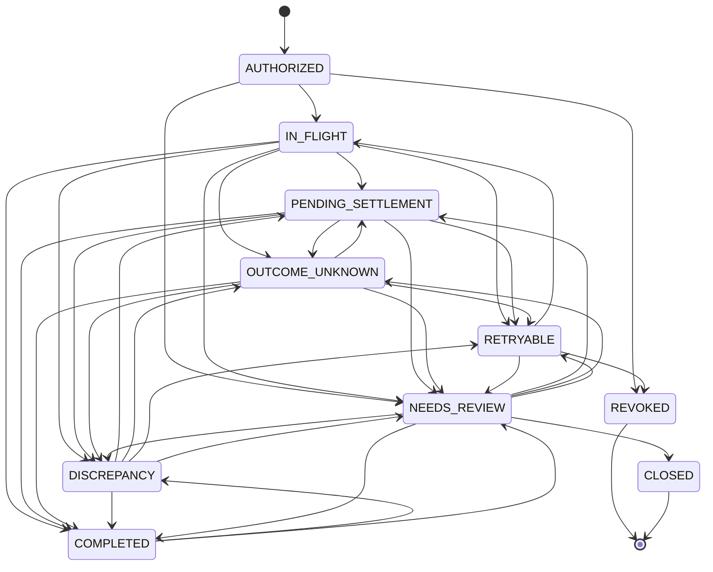

# Intent state machine

Source of truth: `TRANSITIONS` in [`backend/intentguard/domain.py`](../../backend/intentguard/domain.py).
The table and diagram below were generated from it (10 states, 35 legal transitions); the diagram
is also in [`../diagrams/state-machine.mmd`](../diagrams/state-machine.mmd). If `TRANSITIONS`
changes, regenerate both.

Every state change goes through `engine._set_state`, which calls `check_transition` and raises
`IllegalTransition` (HTTP 409) for anything not listed. Staying in the same state is always allowed.
The only exception is the `effect_dedup` ablation, which makes the check permissive so the
benchmark can measure the protocol without that gate.

## States

| State | Meaning |
|---|---|
| `AUTHORIZED` | Approved by an operator; nothing executed yet |
| `IN_FLIGHT` | An attempt has been reserved and is being submitted |
| `PENDING_SETTLEMENT` | The intended effect exists at the provider and is still `PENDING` |
| `OUTCOME_UNKNOWN` | An attempt's result is unknown; reconciling |
| `RETRYABLE` | Verified that no effect exists (or the last one was verifiably reversed); a controlled retry is allowed |
| `DISCREPANCY` | An unintended effect is live; recovery in progress |
| `NEEDS_REVIEW` | Held for a human (an open review case exists) |
| `COMPLETED` | Exactly the intended effect is verified `COMPLETED` at the provider |
| `REVOKED` | Authorization withdrawn before any effect (terminal) |
| `CLOSED` | Closed by a reviewer (terminal) |

## Legal transitions

| From | Legal targets |
|---|---|
| `AUTHORIZED` | `IN_FLIGHT`, `NEEDS_REVIEW`, `REVOKED` |
| `IN_FLIGHT` | `PENDING_SETTLEMENT`, `OUTCOME_UNKNOWN`, `RETRYABLE`, `DISCREPANCY`, `NEEDS_REVIEW`, `COMPLETED` |
| `PENDING_SETTLEMENT` | `OUTCOME_UNKNOWN`, `RETRYABLE`, `DISCREPANCY`, `NEEDS_REVIEW`, `COMPLETED` |
| `OUTCOME_UNKNOWN` | `PENDING_SETTLEMENT`, `RETRYABLE`, `DISCREPANCY`, `NEEDS_REVIEW`, `COMPLETED` |
| `RETRYABLE` | `IN_FLIGHT`, `NEEDS_REVIEW`, `REVOKED` |
| `DISCREPANCY` | `PENDING_SETTLEMENT`, `OUTCOME_UNKNOWN`, `RETRYABLE`, `NEEDS_REVIEW`, `COMPLETED` |
| `NEEDS_REVIEW` | `PENDING_SETTLEMENT`, `OUTCOME_UNKNOWN`, `RETRYABLE`, `DISCREPANCY`, `COMPLETED`, `CLOSED` |
| `COMPLETED` | `DISCREPANCY`, `NEEDS_REVIEW` |
| `REVOKED` | — (terminal) |
| `CLOSED` | — (terminal) |

`COMPLETED → DISCREPANCY` exists because a completed intent is reopened if a late-visible duplicate
or mismatch is found during the post-completion watch.

## How the next state is chosen

Three transitions are set explicitly:

| Transition | Cause |
|---|---|
| `AUTHORIZED`/`RETRYABLE` → `IN_FLIGHT` | An approved proposal, or a controlled retry, reserves an attempt (`engine._reserve`) |
| `AUTHORIZED`/`RETRYABLE` → `REVOKED` | `POST /api/intents/{id}/revoke` (refused in any other state) |
| `NEEDS_REVIEW` → `CLOSED` | A reviewer resolves a case with `CLOSED_UNFULFILLED` |

Every other change is *derived* from the ledger by `engine._derive` after each provider
observation, reconciliation, recovery or review resolution. The first rule that matches wins:

1. `REVOKED` and `CLOSED` never change.
2. An open review case → `NEEDS_REVIEW`.
3. Any live (`PENDING`/`COMPLETED`) effect that is not `INTENDED` and not remediated → `DISCREPANCY`.
4. An effect that counts toward the intent → `COMPLETED` if the provider reports it `COMPLETED`, else `PENDING_SETTLEMENT`.
5. Any attempt `UNKNOWN` → `OUTCOME_UNKNOWN`.
6. Any attempt `SUBMITTING` → `IN_FLIGHT`.
7. Any attempts at all → `RETRYABLE`; none → `AUTHORIZED`.

The derived target must still be a legal transition from the current state.

## Related status sets (not enforced by a transition table)

Attempt status (`AttemptStatus`):

| Status | Set when |
|---|---|
| `SUBMITTING` | Persisted before the provider call |
| `ACKNOWLEDGED` | The provider returned a transaction, or reconciliation attributed one to this attempt |
| `UNKNOWN` | No usable response (timeout, lost response, 5xx); also a `SUBMITTING` attempt whose lease expired or that a previous process left behind |
| `NO_EFFECT` | Verified absent at the provider after the absence window, or confirmed by a reviewer. (With reconciliation ablated, assumed immediately.) If a transaction for it turns up later, it becomes `ACKNOWLEDGED` and `attempt.absence_assumption_violated` is audited |
| `REJECTED` | The provider rejected the request definitively (nothing executed) |

Effect classification (`EffectClass`): `INTENDED`, `DUPLICATE`, `MISMATCH`; see
[data-model.md](data-model.md#effects). Provider status (`ProviderStatus`): `PENDING`, `COMPLETED`
(live), `CANCELLED`, `FAILED`.
