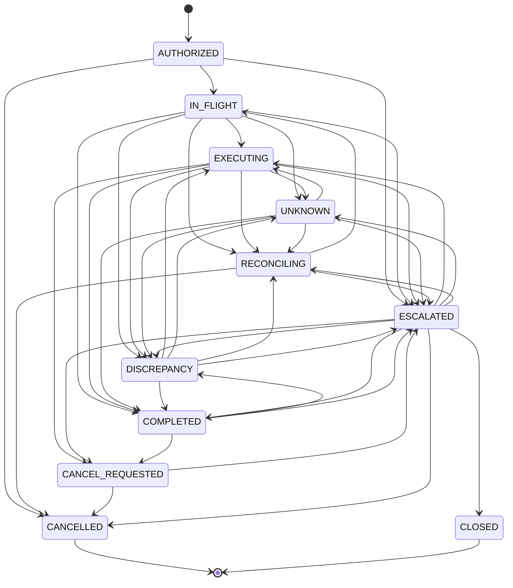

# Intent state machine

Target spec: [ARCHITECTURE.md §4 State model](../ARCHITECTURE.md#4-state-model) (cancel and review resolution: [API.md §3](../API.md#3-authorizations-and-intents), [§7](../API.md#7-review-queue)). This page describes the code as built.

Source of truth: `IntentState`, `TRANSITIONS` and `TERMINAL_STATES` in
[`backend/intentguard/domain.py`](../../backend/intentguard/domain.py). The transition table and the
diagram below were generated from `TRANSITIONS` (11 states, 41 legal transitions); the diagram is also
in [`../diagrams/state-machine.mmd`](../diagrams/state-machine.mmd). If `TRANSITIONS` changes,
regenerate both.

`PROPOSED`, `VALIDATED`, `REJECTED` and `BLOCKED` are not intent states: they are the status of one
proposal (`ProposalStatus`, stored in `agent_proposals.status`; see
[Related status sets](#related-status-sets)). A rejected proposal leaves the intent `AUTHORIZED`, so a
corrected proposal can still be accepted. Cancelling is an action on an intent
([Cancellation](#cancellation)), not an operation.

Every state change goes through `engine._set_state`, which calls `check_transition` and raises
`IllegalTransition` for anything not listed; the API returns it as HTTP 409 `ILLEGAL_TRANSITION`.
Staying in the same state is always allowed. The only exception is the `effect_dedup` ablation, which
makes the check permissive so the benchmark can measure the protocol without that gate.

## States

| State | Meaning |
|---|---|
| `AUTHORIZED` | Created by an operator authorization; no attempt has been made yet (a rejected proposal leaves the intent here) |
| `IN_FLIGHT` | An attempt is reserved (`SUBMITTING`) and is being submitted |
| `EXECUTING` | The intended effect exists at the provider and is still `PENDING` |
| `UNKNOWN` | An attempt's outcome is unknown; the gateway is reconciling |
| `RECONCILING` | Attempts exist but no live effect counts toward the intent: absence was verified, the provider rejected the request, or a wrong effect was removed. A controlled retry or a new proposal is allowed |
| `DISCREPANCY` | A live effect that is not the intended one (wrong amount, order, customer, currency or operation, or a second matching effect) and is not remediated; recovery is in progress |
| `CANCEL_REQUESTED` | An operator asked to cancel; live effects are being cancelled at the provider and verified |
| `ESCALATED` | Held for a human: an open review case exists |
| `COMPLETED` | Exactly the intended effect is verified `COMPLETED` at the provider |
| `CANCELLED` | Cancelled with no live, unremediated effect in the ledger (terminal) |
| `CLOSED` | Written off by a reviewer (terminal) |

## Legal transitions

| From | Legal targets |
|---|---|
| `AUTHORIZED` | `IN_FLIGHT`, `ESCALATED`, `CANCELLED` |
| `IN_FLIGHT` | `EXECUTING`, `UNKNOWN`, `RECONCILING`, `DISCREPANCY`, `ESCALATED`, `COMPLETED` |
| `EXECUTING` | `UNKNOWN`, `RECONCILING`, `DISCREPANCY`, `CANCEL_REQUESTED`, `ESCALATED`, `COMPLETED` |
| `UNKNOWN` | `EXECUTING`, `RECONCILING`, `DISCREPANCY`, `ESCALATED`, `COMPLETED` |
| `RECONCILING` | `IN_FLIGHT`, `ESCALATED`, `CANCELLED` |
| `DISCREPANCY` | `EXECUTING`, `UNKNOWN`, `RECONCILING`, `ESCALATED`, `COMPLETED` |
| `CANCEL_REQUESTED` | `ESCALATED`, `CANCELLED` |
| `ESCALATED` | `EXECUTING`, `UNKNOWN`, `RECONCILING`, `DISCREPANCY`, `CANCEL_REQUESTED`, `COMPLETED`, `CANCELLED`, `CLOSED` |
| `COMPLETED` | `DISCREPANCY`, `CANCEL_REQUESTED`, `ESCALATED` |
| `CANCELLED` | none (terminal) |
| `CLOSED` | none (terminal) |

Notes on some edges:

- `COMPLETED → DISCREPANCY`: a completed intent is reopened if a late-visible duplicate or mismatch is
  found during the post-completion watch ([reconciliation.md](reconciliation.md#post-completion-watch)).
- `COMPLETED → CANCEL_REQUESTED`: a completed authorization hold can still be voided. A completed
  refund cannot (409 `NOT_CANCELLABLE`, see [Cancellation](#cancellation)).
- The table is what `check_transition` permits. It does not claim that every edge is produced by a
  current code path.

## How the next state is chosen

Three transitions are set explicitly:

| Transition | Cause |
|---|---|
| `AUTHORIZED`/`RECONCILING` → `IN_FLIGHT` | An allowed proposal, or a controlled retry, reserves an attempt (`engine._reserve`) |
| `AUTHORIZED`/`RECONCILING` → `CANCELLED` | `engine.cancel`. In these states no attempt is in progress and no live, unremediated effect exists, so nothing has to be reversed |
| `ESCALATED` → `CLOSED` | A reviewer resolves a case with `WRITTEN_OFF` |

Every other change is *derived* from the ledger by `engine._derive`, which `engine._refresh` calls
after each provider observation, reconciliation pass, recovery pass, cancellation request and review
resolution. The first rule that matches wins:

1. `CANCELLED` and `CLOSED` never change.
2. An open review case → `ESCALATED`.
3. A cancellation was requested (`intents.cancel_requested_at` is set) → `CANCEL_REQUESTED` while any
   live (`PENDING`/`COMPLETED`), unremediated effect exists, otherwise `CANCELLED`.
4. Any live effect that is not `INTENDED` and not remediated → `DISCREPANCY`.
5. An effect that counts toward the intent → `COMPLETED` if the provider reports it `COMPLETED`, else `EXECUTING`.
6. Any attempt `UNKNOWN` → `UNKNOWN`.
7. Any attempt `SUBMITTING` → `IN_FLIGHT`.
8. Any attempts at all → `RECONCILING`; none → `AUTHORIZED`.

Before deriving, `_refresh` promotes a live `DUPLICATE` effect to `INTENDED` when no effect counts
toward the intent any more (for example because the counted one was cancelled). The derived target
must still be a legal transition from the current state.

After a change, `engine._drive` continues (at most 10 steps) while the gateway can act on its own:

| State | Step |
|---|---|
| `UNKNOWN`, `EXECUTING` | `reconcile` |
| `DISCREPANCY`, `CANCEL_REQUESTED` | `recover` |
| `RECONCILING` | `_maybe_retry`: a controlled retry if the evidence allows it |

It stops when a step leaves the state unchanged, or in any other state. The background worker picks
the intent up again when its next check is due ([reconciliation.md](reconciliation.md#the-background-worker)).

## Which states accept a proposal

`checks.state_findings` (with the `effect_dedup` component on), checked in this order. A decision is
an HTTP 200 body, never an error; when several findings apply, the precedence is
`REJECT` > `HOLD_FOR_REVIEW` > `DUPLICATE`.

| Intent state | Decision (finding) |
|---|---|
| `CANCELLED`, `CLOSED`, `CANCEL_REQUESTED` | `REJECT` (`INTENT_NOT_ACTIVE`) |
| `ESCALATED` | `HOLD_FOR_REVIEW` (`HELD_FOR_REVIEW`) |
| `COMPLETED`, `EXECUTING`, or any other state while an effect counts toward the intent | `DUPLICATE` (`ALREADY_COMPLETED`) |
| `IN_FLIGHT`, `UNKNOWN`, `DISCREPANCY` | `DUPLICATE` (`ATTEMPT_IN_PROGRESS`) |
| `AUTHORIZED`, `RECONCILING` with the attempt budget used up | `HOLD_FOR_REVIEW` (`ATTEMPT_BUDGET_EXHAUSTED`) |
| `AUTHORIZED`, `RECONCILING` otherwise | `ALLOW`, unless the binding, authority or policy checks add a `REJECT` or `HOLD_FOR_REVIEW` finding (see [overview.md](overview.md#gateway-checks)) |

Only `ALLOW` reserves an attempt (`AUTHORIZED`/`RECONCILING` → `IN_FLIGHT`).

## Cancellation

`POST /api/intents/{id}/cancel` (capability `cancel`: operator, reviewer, admin) calls
`engine.cancel` and answers HTTP 202 with `{intent_id, state}`.

| State when cancel is requested | Result |
|---|---|
| `AUTHORIZED`, `RECONCILING` | `CANCELLED` at once, no provider call (`intent.cancelled` is audited) |
| `IN_FLIGHT`, `UNKNOWN` | 409 `ATTEMPT_IN_PROGRESS`: the attempt's outcome must be known first |
| `EXECUTING`, `COMPLETED`, with a live effect the cancellation policy does not allow (a `COMPLETED` refund) | 409 `NOT_CANCELLABLE` |
| `EXECUTING`, `COMPLETED` otherwise (a pending refund, a pending or completed authorization hold) | `cancel_requested_at`/`cancel_requested_by` are recorded, `intent.cancel_requested` is audited, the intent re-derives to `CANCEL_REQUESTED` and is driven at once |
| `DISCREPANCY`, `CANCEL_REQUESTED`, `ESCALATED`, `CANCELLED`, `CLOSED` | 409 `STATE_CONFLICT` |

In `CANCEL_REQUESTED`, `engine.recover` treats every live, unremediated effect (the intended one
included) as one to reverse. It re-reads each one at the provider and, where the cancellation policy
allows it, cancels it and reads it back:

- read-back shows `CANCELLED` → `effect.reversal_verified`; once nothing live is left the intent
  becomes `CANCELLED`;
- the provider refuses the cancel → review case `CANCEL_REJECTED` → `ESCALATED`;
- the read-back still shows the effect live → review case `CANCEL_UNVERIFIED` → `ESCALATED`;
- the effect can no longer be cancelled (for example a refund that settled in the meantime) → review
  case `IRREVERSIBLE_DISCREPANCY` → `ESCALATED`;
- no usable answer → the try is counted on the effect; `CANCEL_UNVERIFIED` after `max_cancel_tries`
  (3). Until then the intent stays `CANCEL_REQUESTED` and the worker tries again.

The `state` in the 202 response is the state reached within the request: `CANCELLED`,
`CANCEL_REQUESTED` or `ESCALATED`. A proposal for an intent in `CANCEL_REQUESTED` is rejected
(`INTENT_NOT_ACTIVE`).

## Review cases and resolutions

Review cases are opened by the engine (`_open_review`), at most one open case per intent and reason:

| Reason | Opened when |
|---|---|
| `UNRESOLVABLE_OUTCOME` | The intent is still `UNKNOWN` `unknown_review_after_s` (300 s) after the outcome first became unknown |
| `IRREVERSIBLE_DISCREPANCY` | A live effect must be reversed but the cancellation policy does not allow it (a `COMPLETED` refund) |
| `CANCEL_REJECTED` | The provider refused a cancel |
| `CANCEL_UNVERIFIED` | The read-back after a cancel is not `CANCELLED`, or `max_cancel_tries` tries gave no usable answer |
| `ATTEMPT_BUDGET_EXHAUSTED` | A controlled retry would exceed `max_attempts` (3) |
| `INVESTIGATOR_ESCALATION` | An investigator `ESCALATE` recommendation was applied (`engine.escalate`) |

`POST /api/review-cases/{id}/resolve` (capability `reviews:resolve`: reviewer, admin) calls
`engine.resolve_review`. It is refused with 409 `ALREADY_RESOLVED` if the case is not open, and with
403 `SEPARATION_OF_DUTIES` when the reviewer is the operator who authorized the intent (policy
`separation_of_duties`, on by default). The resolution is audited as `review.resolved`.

| Resolution | Ledger change | Resulting state |
|---|---|---|
| `ACCEPTED_AS_IS` | Requires an effect that counts toward the intent, else 409 `NO_VERIFIED_EFFECT`. Clears a pending cancellation request: the effect stands | Re-derived: `EXECUTING` or `COMPLETED` (`ESCALATED` while another case is open) |
| `REFUND_RECOVERED_OUT_OF_BAND` | Live unintended effects (every live effect, if a cancellation was requested) are marked remediated and stop counting; `key_generation` is incremented | Re-derived: `CANCELLED` if a cancellation was requested; `COMPLETED`/`EXECUTING` if an intended effect remains; `RECONCILING` followed by a controlled retry under the new key if the remediated effect came from the last attempt |
| `CONFIRMED_NO_EFFECT` | `UNKNOWN` and `SUBMITTING` attempts become `RECONCILED` ("confirmed absent by reviewer") | Re-derived: `RECONCILING`, followed by a controlled retry under the same key, within the attempt budget |
| `WRITTEN_OFF` | Every other open case of the intent is resolved too | `CLOSED`, set explicitly (terminal). Effects at the provider are left as they are |
| `OTHER` | None; the note is recorded | Re-derived from the ledger. If the condition persists the engine can open a new case, for example `UNRESOLVABLE_OUTCOME` again while the provider is still unreachable |

Every resolution except `WRITTEN_OFF` is followed by `_refresh` and `_drive`.

## Related status sets

These are not enforced by a transition table.

Proposal status (`ProposalStatus`, one per proposal, in `agent_proposals.status`):

| Status | Meaning |
|---|---|
| `PROPOSED` | Defined but never stored: `_decide` evaluates the proposal before it writes the row |
| `VALIDATED` | Decision `ALLOW`; the gateway executes it |
| `REJECTED` | Decision `REJECT`: it does not match the authorization or is not permitted |
| `BLOCKED` | Decision `DUPLICATE` or `HOLD_FOR_REVIEW`: valid, but blocked by intent state or policy |

Attempt status (`AttemptStatus`):

| Status | Set when |
|---|---|
| `SUBMITTING` | Persisted before the provider call |
| `SUCCEEDED` | The provider returned a transaction, or reconciliation attributed one to this attempt (by `attempt_id` metadata or by the same idempotency key) |
| `UNKNOWN` | No usable response (timeout, 504, other 5xx, network error); also a `SUBMITTING` attempt whose lease expired or that a previous process left behind |
| `RECONCILED` | Verified absent at the provider after the absence window, or confirmed absent by a reviewer. (With reconciliation ablated, assumed immediately.) If a transaction for it turns up later, it becomes `SUCCEEDED` and `attempt.absence_assumption_violated` is audited |
| `FAILED` | The provider rejected the request definitively (nothing executed) |

Effect classification (`EffectClass`): `INTENDED`, `DUPLICATE`, `MISMATCH`; see
[data-model.md](data-model.md#effects). Provider status (`ProviderStatus`): `PENDING`, `COMPLETED`
(live), `CANCELLED`, `FAILED`.
