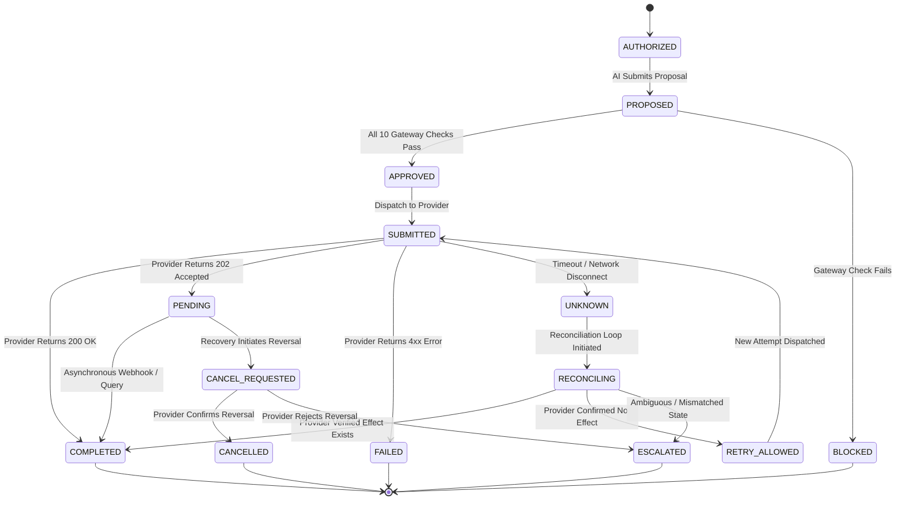

> **Superseded - describes the earlier prototype. Numbers here are not measured results.** See [docs/README.md](../README.md) for the current documentation.

# 05. State Machine

## Formal Finite State Machine Specification

IntentGuard models all transaction lifecycles using a deterministic Finite State Machine (FSM). Arbitrary state jumps are strictly prohibited; any invalid transition throws an `InvalidStateTransitionException` and halts processing.

---

## 1. State Enumeration

| State Name | Classification | Semantic Meaning |
| :--- | :--- | :--- |
| `AUTHORIZED` | Initial | Operator has created a durable authorization record. |
| `PROPOSED` | Active | AI agent has submitted a structured execution proposal. |
| `APPROVED` | Active | Safety gateway has validated the proposal against all 10 checks. |
| `BLOCKED` | Terminal / Rejected | Safety gateway identified a discrepancy; execution halted. |
| `SUBMITTED` | Active | Execution request has been dispatched to the payment provider. |
| `PENDING` | Active | Provider accepted request for asynchronous processing. |
| `COMPLETED` | Terminal / Success | Provider has verified settlement; effect recorded in ledger. |
| `FAILED` | Terminal / Failure | Provider explicitly rejected the transaction. |
| `UNKNOWN` | Intermediate | Request timed out or network disconnected; status unverified. |
| `RECONCILING` | Active | Reconciliation service is querying external provider state. |
| `RETRY_ALLOWED` | Active | Reconciliation confirmed zero provider effect; safe retry granted. |
| `CANCEL_REQUESTED` | Active | Cancellation request sent to payment provider. |
| `CANCELLED` | Terminal / Revoked | Payment provider confirmed reversal of the effect. |
| `ESCALATED` | Terminal / Review | Automated resolution failed; escalated for human operator review. |

---

## 2. Valid Transition Table



---

## 3. Strict Transition Matrix

```python
LEGAL_TRANSITIONS: dict[TransactionState, set[TransactionState]] = {
    TransactionState.AUTHORIZED: {TransactionState.PROPOSED},
    TransactionState.PROPOSED: {TransactionState.APPROVED, TransactionState.BLOCKED},
    TransactionState.APPROVED: {TransactionState.SUBMITTED, TransactionState.BLOCKED},
    TransactionState.SUBMITTED: {
        TransactionState.COMPLETED,
        TransactionState.PENDING,
        TransactionState.FAILED,
        TransactionState.UNKNOWN,
    },
    TransactionState.PENDING: {
        TransactionState.COMPLETED,
        TransactionState.FAILED,
        TransactionState.CANCEL_REQUESTED,
        TransactionState.UNKNOWN,
    },
    TransactionState.UNKNOWN: {TransactionState.RECONCILING},
    TransactionState.RECONCILING: {
        TransactionState.COMPLETED,
        TransactionState.RETRY_ALLOWED,
        TransactionState.CANCEL_REQUESTED,
        TransactionState.ESCALATED,
    },
    TransactionState.RETRY_ALLOWED: {TransactionState.SUBMITTED},
    TransactionState.CANCEL_REQUESTED: {
        TransactionState.CANCELLED,
        TransactionState.ESCALATED,
    },
    TransactionState.COMPLETED: set(),        # Terminal
    TransactionState.BLOCKED: set(),          # Terminal
    TransactionState.FAILED: set(),           # Terminal
    TransactionState.CANCELLED: set(),        # Terminal
    TransactionState.ESCALATED: set(),        # Terminal
}
```
