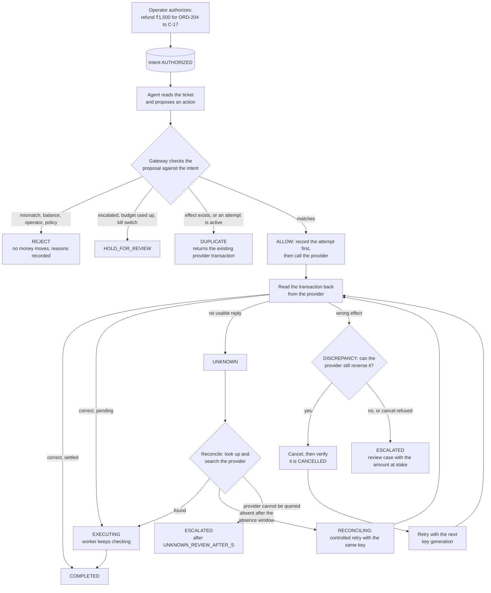

# Overview: the identity model

This page describes the code as built. The target product is specified in
[../PRD.md](../PRD.md) and its feature list, with the status of each feature, in
[../FEATURES.md](../FEATURES.md).

> Do not trust what the agent says it did, or what the network says happened. Check the state at
> the provider.

IntentGuard keeps four objects apart that simpler integrations merge into one "request":

| Object | Created by | Meaning | Example | Where |
|---|---|---|---|---|
| **Intent** | Operator, through an authorization (`POST /api/authorizations`) | What is *allowed* to happen: operation, customer, order, exact amount, currency | Refund ₹1,500 on ORD-204 to C-17, `INT-1001` | `intents` table, `IntentGuard.authorize` |
| **Proposal** | Agent (`POST /api/intents/{id}/proposals`, or `/agent` to extract one from the ticket) | What the agent *asks* for. Never trusted on its own; every proposal is stored with the gateway's decision | Refund ₹15,000 on ORD-204 to C-17, `PRP-1`: `REJECT` | `agent_proposals` and `gateway_decisions` tables, `checks.Proposal` |
| **Attempt** | Gateway | One provider API call, persisted *before* the call, carrying the intent's provider idempotency key | `ATT-001`, key `ig-INT-1001-g0` | `transaction_attempts` table |
| **Effect** | Provider | A transaction actually observed at the provider and attributed to an intent | `rf_…`, ₹1,500, `COMPLETED`, class `INTENDED` | `effects` table |

Because they are separate:

- a wrong proposal is rejected before any money moves, and the intent stays `AUTHORIZED`, so a
  corrected proposal can still be accepted (proposal ≠ intent);
- a timeout is an attempt with an *unknown* result, not a failure and not a success;
- a crashed and restarted agent produces a new proposal for the *same* intent, so it cannot open a
  second authorization or reach the provider with a different idempotency key;
- an intent is `COMPLETED` only when an effect matching it is seen at the provider and has settled.
  Intent state is derived from attempts and effects (`engine._derive`), and every change is checked
  against `TRANSITIONS` in `backend/intentguard/domain.py`
  ([../architecture/state-machine.md](../architecture/state-machine.md)). The database allows at
  most one effect per intent to count toward it (partial unique index on `effects`).

## A refund, step by step

A reconciled effect that has already settled goes straight to `COMPLETED`. Details:
[../architecture/reconciliation.md](../architecture/reconciliation.md).

## What the agent gets back

`POST /api/intents/{id}/proposals` answers HTTP 200 with a `decision`, the reason codes
(`reason` is the first, `reasons` all of them), the intent's `state` and whether the outcome is
`verified` at the provider. A decision is never an HTTP error. When several checks fail, the
decision follows the precedence `REJECT` > `HOLD_FOR_REVIEW` > `DUPLICATE`.

| Decision | Reason codes | Meaning | What the agent should do |
|---|---|---|---|
| `ALLOW` (state `COMPLETED`) | none | Executed and verified at the provider | Report success |
| `ALLOW` (state `EXECUTING`, `UNKNOWN`, `RECONCILING`, `DISCREPANCY`, `ESCALATED`) | none | The gateway owns the intent now | Stop. Do not retry; the gateway finishes or escalates |
| `REJECT` | `OPERATION_MISMATCH`, `CUSTOMER_MISMATCH`, `ORDER_MISMATCH`, `CURRENCY_MISMATCH`, `AMOUNT_EXCEEDS_AUTHORIZATION`, `AMOUNT_BELOW_AUTHORIZATION`, `EXCEEDS_REMAINING_BALANCE`, `OPERATOR_NOT_PERMITTED`, `POLICY_LIMIT_EXCEEDED`, `INTENT_NOT_ACTIVE` | The proposal does not match the authorization (the amount must match exactly), the order's remaining balance would be exceeded, the authorizing operator is no longer active or permitted, the amount is above the admin limit, or the intent is cancelled, closed or being cancelled | Fix the proposal, or stop |
| `DUPLICATE` | `ALREADY_COMPLETED` | The intended effect already exists; its `provider_transaction_id` is returned | Stop |
| `DUPLICATE` | `ATTEMPT_IN_PROGRESS` | Another attempt is in flight, unknown or being recovered | Wait |
| `HOLD_FOR_REVIEW` | `HELD_FOR_REVIEW`, `ATTEMPT_BUDGET_EXHAUSTED`, `KILL_SWITCH` | The intent is escalated, the attempt budget is used up, or an admin turned the kill switch on | Wait for a reviewer |

Each proposal also gets a status: `VALIDATED` (decision `ALLOW`), `REJECTED` (`REJECT`) or
`BLOCKED` (`DUPLICATE`, `HOLD_FOR_REVIEW`). The checks are listed in
[../architecture/overview.md](../architecture/overview.md).

## What a reviewer can decide

A review case carries a reason and the amount at stake:

| Reason | Opened when |
|---|---|
| `UNRESOLVABLE_OUTCOME` | An attempt's outcome is still unknown after `UNKNOWN_REVIEW_AFTER_S` (300 s) because the provider cannot be queried |
| `IRREVERSIBLE_DISCREPANCY` | A wrong live effect can no longer be reversed through the provider (for example a completed refund) |
| `CANCEL_REJECTED` | The provider refused a cancellation |
| `CANCEL_UNVERIFIED` | A cancellation could not be confirmed after repeated tries, or the effect was still live afterwards |
| `ATTEMPT_BUDGET_EXHAUSTED` | A controlled retry would exceed the attempt budget |
| `INVESTIGATOR_ESCALATION` | A user applied the AI investigator's `ESCALATE` recommendation |

Reviewers and admins resolve cases (`POST /api/review-cases/{id}/resolve`, or the Review queue).
The person who authorized the intent cannot resolve its case (`403 SEPARATION_OF_DUTIES`; an admin
policy, on by default).

| Resolution | When | Effect |
|---|---|---|
| `ACCEPTED_AS_IS` | The intended effect exists and stands. Refused with `409 NO_VERIFIED_EFFECT` when no verified intended effect is in the ledger | A pending cancel request is dropped; the intent state is re-derived (normally `COMPLETED`, or `EXECUTING` until it settles) |
| `CONFIRMED_NO_EFFECT` | The reviewer verified that nothing executed | Unknown attempts become `RECONCILED`; the gateway may make a controlled retry with the same key |
| `REFUND_RECOVERED_OUT_OF_BAND` | The wrong effect was handled outside the system | Live unintended effects (all live effects if a cancel was requested) are marked remediated and stop counting; the key generation is bumped; the gateway retries with the new key |
| `WRITTEN_OFF` | Give up on the intent | All open cases of the intent close; intent becomes `CLOSED` (terminal) |
| `OTHER` | Close the case with a note | Nothing is assumed; the intent is re-derived and driven again. If the problem persists, a new case opens |

## Roles

Every API call is authenticated (`backend/gateway_api/security.py`). People log in with email and
password; agents use service tokens.

| Role | Can | Cannot |
|---|---|---|
| `operator` | Authorize intents within their permitted operations and limit, submit proposals, run the agent, reconcile an attempt, cancel, investigate exceptions and apply permitted recommendations, read intents, reviews, audit, metrics, orders and reconciliation; use the simulator-only endpoints | Resolve review cases, verify the audit chain, run matching, resolve mismatches, administer |
| `reviewer` | Everything an operator can, plus resolve review cases, verify the audit chain, run matching and mark mismatches handled | Administer |
| `admin` | Everything a reviewer can, plus users, agent service tokens, policies (kill switch, maximum amount, separation of duties, attempt budget, absence window, unknown-review timeout), provider connection and orders | |
| `agent` | Submit proposals for, and read, only the intents (or customers' intents) its token is scoped to. Tokens last at most 300 s and can be revoked | Log in, authorize, cancel, investigate, use any other endpoint |

## The dashboard

`frontend/` (React and Vite) signs in against the same API and shows only what the user's role
allows: **Overview** (metrics, the four demo cards, a live console of audit events and recent
intents), **Intents** (list, new authorization, detail page with pipeline, timeline, attempts,
effects, proposals, the AI investigator and cancel), **Exceptions**, **Review queue**,
**Reconciliation** (matching runs and mismatches), **Audit** (search and chain verification),
**Experiments** (latest benchmark results) and, for admins, **Admin**. The top bar always shows
"Simulated provider · no real money". Walkthrough: [../operations/demo.md](../operations/demo.md).

## Glossary

| Term | Meaning |
|---|---|
| Authorization | An operator's approval of one operation; creates the intent (`POST /api/authorizations`) |
| Intent | An operator-approved operation: who, which order, what operation, exactly how much. States: `AUTHORIZED`, `IN_FLIGHT`, `EXECUTING`, `UNKNOWN`, `RECONCILING`, `DISCREPANCY`, `CANCEL_REQUESTED`, `ESCALATED`, `COMPLETED`, `CANCELLED`, `CLOSED` (the last two are terminal) |
| Proposal | What an agent asks the gateway to do; checked against the intent. Status `PROPOSED`, `VALIDATED`, `REJECTED` or `BLOCKED` |
| Decision | The gateway's answer to a proposal: `ALLOW`, `REJECT`, `DUPLICATE` or `HOLD_FOR_REVIEW` |
| Reason code (finding) | Why a check did not pass, e.g. `ORDER_MISMATCH`, `EXCEEDS_REMAINING_BALANCE`, `ATTEMPT_IN_PROGRESS` |
| Attempt | One provider call, recorded before it is made. Status `SUBMITTING`, `SUCCEEDED`, `UNKNOWN`, `RECONCILED` (verified that it produced no effect) or `FAILED` (definitively rejected by the provider) |
| Effect | A transaction that exists at the provider and is attributed to an intent. Provider status `PENDING`, `COMPLETED`, `CANCELLED` or `FAILED`; `PENDING` and `COMPLETED` are live |
| Effect class | `INTENDED` (matches the intent), `DUPLICATE` (matches, but another intended effect is live), `MISMATCH` (wrong order, customer, amount, currency or operation) |
| Idempotency key | Sent by the gateway with each create call: `ig-<intent>-g<generation>`. The provider replays the original transaction for a repeated key with the same parameters and rejects one with different parameters |
| Key generation | The `g<n>` suffix. Bumped only after a wrong effect is verifiably reversed or a reviewer records it as recovered out of band |
| Reconciliation | Asking the provider what actually happened after an unknown result, by transaction id and by searching the order |
| Absence window | How long after an attempt "not found" may be trusted as "did not happen" (`ABSENCE_WINDOW_S`, 30 s) |
| Controlled retry | A new attempt the gateway makes itself, only after absence is verified (or a wrong effect verifiably reversed) and within the attempt budget |
| Discrepancy | A live effect that does not match the intent, or a duplicate |
| Cancel | The operator action `POST /api/intents/{id}/cancel`. Pending effects are cancelled at the provider and the cancellation verified before the intent is `CANCELLED` |
| Review case | A problem handed to a human, with a reason and the amount at stake (`RC-n`) |
| Resolution | How a reviewer closed a case: `ACCEPTED_AS_IS`, `CONFIRMED_NO_EFFECT`, `REFUND_RECOVERED_OUT_OF_BAND`, `WRITTEN_OFF`, `OTHER` |
| Separation of duties | Policy: whoever authorized an intent cannot resolve its review case |
| Kill switch | Admin policy: no new proposal is allowed; each is held for review (`KILL_SWITCH`) unless a check already rejects it, and nothing new reaches the provider |
| Exception | An intent in `UNKNOWN`, `RECONCILING`, `DISCREPANCY`, `CANCEL_REQUESTED` or `ESCALATED` |
| AI investigator | Classifies an exception and recommends one of `MARK_COMPLETED`, `WAIT_AND_RECHECK`, `CONTROLLED_RETRY`, `CANCEL_PENDING`, `ESCALATE`. Advisory: offline rules by default, an LLM when configured |
| Policy gate | Deterministic code (`backend/investigator/policy.py`) that decides whether a recommendation may run; re-checked on fresh evidence when it is applied |
| Matching run | A reconciliation run that compares the gateway's ledger with the provider order by order and records mismatches (`MISSING`, `DUPLICATE`, `AMOUNT`, `ORDER`, `CUSTOMER`). It changes nothing |
| Webhook | A signed status-change event from the provider. Treated as a hint: the gateway re-reads the transaction from the provider |
| Audit chain | Per-intent log in which each entry's hash covers the previous entry's hash, so edits are detectable; the database refuses updates and deletes |
| Minor units | Money is stored as integers in the currency's smallest unit (paise for INR); the API uses decimal strings in major units |
| Simulator mode | `SIMULATOR_MODE=true`: enables fault injection, the provider ledger and demo orders. Sandbox only |
| Arm | One architecture compared in the benchmark (baselines A–D, IntentGuard E, ablations X) |
| Ablation | IntentGuard with one or two components switched off through `ProtocolConfig` |
