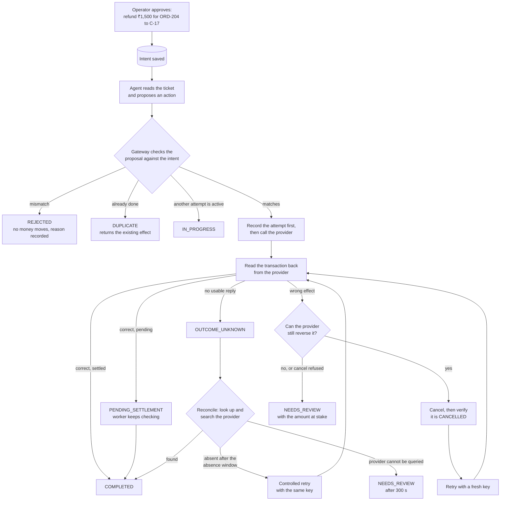

# Overview: the identity model

> Do not trust what the agent says it did, or what the network says happened. Check the state at
> the provider.

IntentGuard keeps four objects apart that simpler integrations merge into one "request":

| Object | Created by | Meaning | Example | Where |
|---|---|---|---|---|
| **Intent** | Operator | What is *allowed* to happen: operation, customer, order, exact amount, currency | Refund ₹1,500 on ORD-204 to C-17 | `intents` table, `IntentGuard.authorize` |
| **Proposal** | Agent | What the agent *asks* for. Never trusted on its own; every proposal is recorded with its decision | Refund ₹15,000 on ORD-204 to C-17 → `REJECTED` | `proposals` table, `checks.Proposal` |
| **Attempt** | Gateway | One provider API call, persisted *before* the call, carrying the intent's idempotency key | attempt #1, key `ig-int_ab12…-g0` | `attempts` table |
| **Effect** | Provider | A transaction actually observed at the provider and attributed to an intent | `rf_…0001`, ₹1,500, `COMPLETED` | `effects` table |

Because they are separate:

- a wrong proposal is rejected before any money moves (proposal ≠ intent);
- a timeout is an attempt with an *unknown* result, not a failure and not a success;
- a crashed and restarted agent produces a new proposal for the *same* intent, so it cannot open a
  second authorization or reuse a different provider key;
- an intent is `COMPLETED` only when an effect matching it is seen at the provider. Intent state is
  derived from attempts and effects (`engine._derive`) and every change is checked against
  `TRANSITIONS` in `backend/intentguard/domain.py`.

## A refund, step by step

## What the agent gets back

`POST /api/intents/{id}/proposals` returns a `decision` and the intent's state:

| Decision | Meaning | What the agent should do |
|---|---|---|
| `APPROVED` (state `COMPLETED`) | Executed and verified at the provider | Report success |
| `APPROVED` (state `PENDING_SETTLEMENT`, `OUTCOME_UNKNOWN`, `DISCREPANCY`, `NEEDS_REVIEW`) | The gateway owns the intent now | Stop. Do not retry; the gateway finishes or escalates |
| `REJECTED` | The proposal does not match the authorization, the order balance would be exceeded, the authorizing operator is no longer active or permitted, or the intent is revoked/closed | Fix the proposal, or stop |
| `DUPLICATE` | The intended effect already exists; its `provider_ref` is returned | Stop |
| `IN_PROGRESS` | Another attempt is in flight or being reconciled | Wait |
| `HELD` | Held for human review, or the attempt budget is used up | Wait for a reviewer |

The checks behind these decisions are listed in [../architecture/overview.md](../architecture/overview.md#gateway-checks).

## What a reviewer can decide

Open review cases carry a reason (`UNRESOLVABLE_OUTCOME`, `IRREVERSIBLE_DISCREPANCY`,
`CANCEL_REJECTED`, `CANCEL_UNVERIFIED`, `ATTEMPT_BUDGET_EXHAUSTED`) and the amount at stake.

| Resolution | When | Effect |
|---|---|---|
| `CONFIRMED_COMPLETED` | The intended effect exists. Refused if no verified intended effect is in the ledger | Intent state is re-derived (normally `COMPLETED`) |
| `CONFIRMED_NO_EFFECT` | The reviewer verified nothing executed | Unknown attempts become `NO_EFFECT`; the gateway may retry |
| `MANUALLY_REMEDIATED` | The wrong effect was handled outside the system | Wrong effects are marked remediated, the key generation is bumped, and the gateway retries with a fresh key |
| `CLOSED_UNFULFILLED` | Give up on the intent | All open cases close; intent → `CLOSED` |

## Glossary

| Term | Meaning |
|---|---|
| Intent | An operator-approved operation: who, which order, what operation, exactly how much |
| Proposal | What an agent asks the gateway to do; checked against the intent |
| Attempt | One provider call, recorded before it is made |
| Effect | A transaction that exists at the provider and is attributed to an intent |
| Effect class | `INTENDED` (matches the intent), `DUPLICATE` (matches, but another intended effect is live), `MISMATCH` (wrong order, customer, amount, currency or operation) |
| Idempotency key | Sent with each create call. The provider replays the original transaction for a repeated key with the same parameters and rejects one with different parameters |
| Key generation | The `g<n>` suffix of `ig-<intent>-g<n>`. Bumped only after a wrong effect is verifiably reversed or manually remediated |
| Reconciliation | Asking the provider what actually happened after an unknown result |
| Absence window | How long after an attempt "not found" may be trusted as "did not happen" (`ABSENCE_WINDOW_S`, 30 s) |
| Discrepancy | A live effect that does not match the intent, or a duplicate |
| Review case | A problem handed to a human, with the amount at stake |
| Audit chain | Per-intent log where each event's hash covers the previous event's hash, so edits are detectable |
| Minor units | Money is stored as integers in the currency's smallest unit (paise for INR) |
| Arm | One architecture compared in the benchmark (baselines A–D, IntentGuard E, ablations) |
| Ablation | IntentGuard with one or two components switched off through `ProtocolConfig` |
